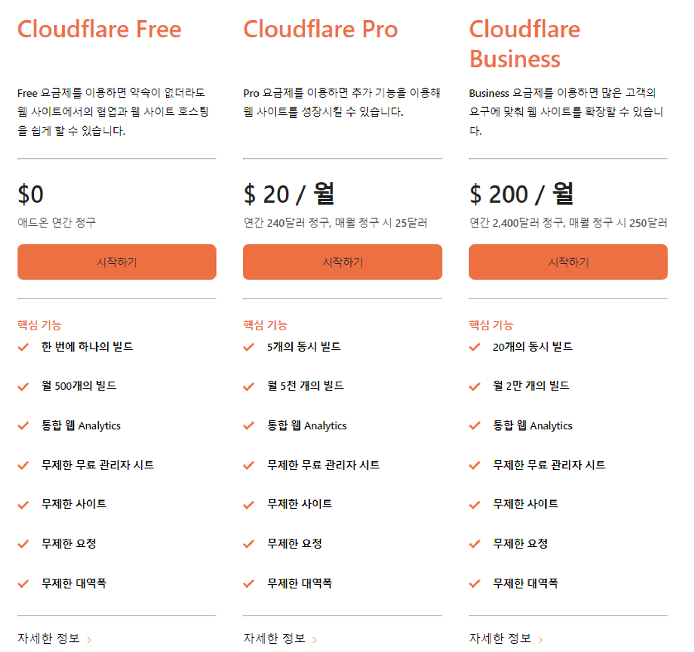
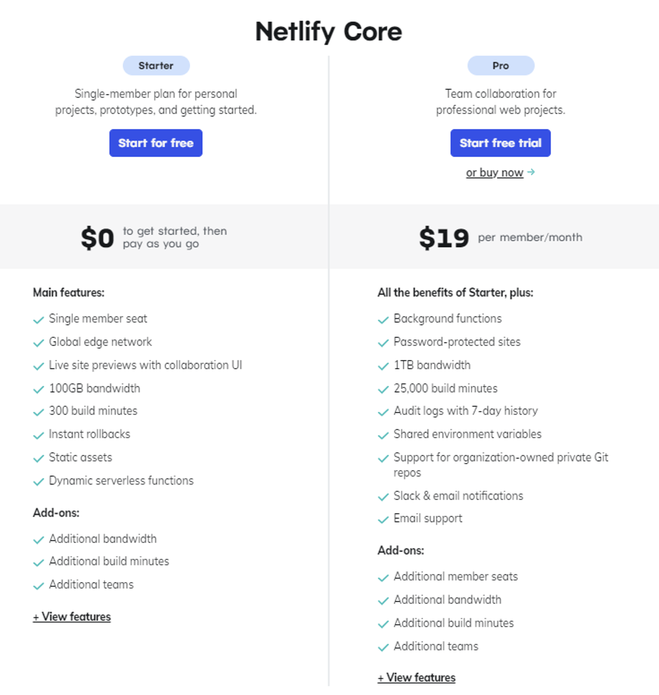
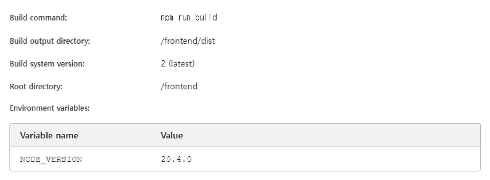
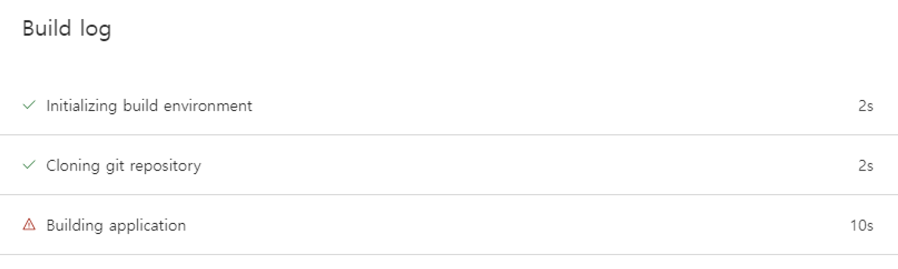
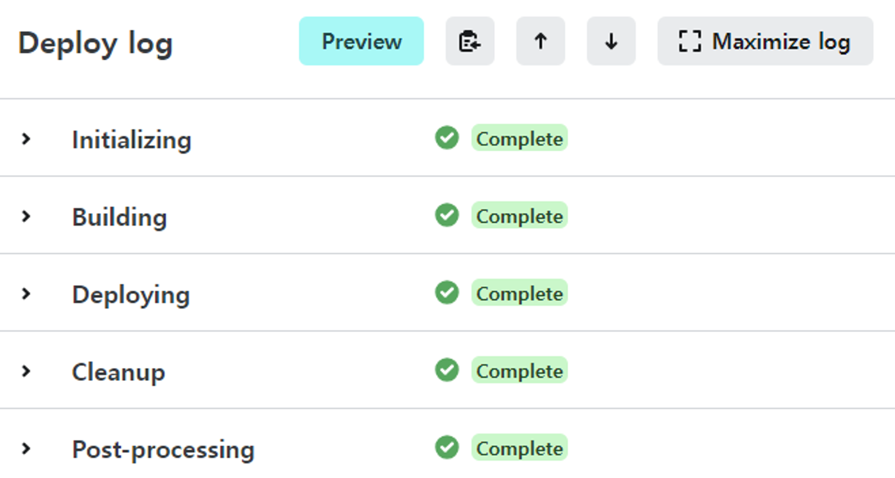
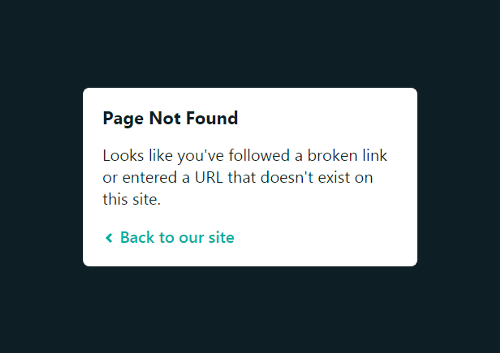
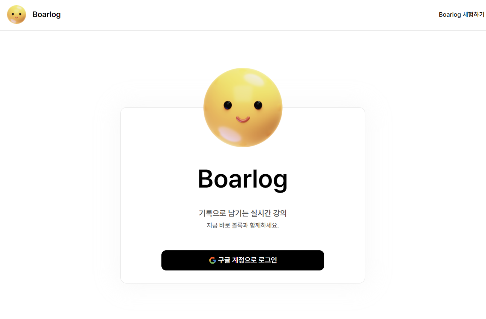

> 해당 글은 부스트캠프 웹・모바일 8기 멤버십 활동과 관련된 내용을 담고 있습니다.

## 신나는 배포 시작

FE 공통 개발 환경 설정 이후에 우리가 의도한 방식으로 잘 동작하는지를 확인하기 위해 가장 간단한 페이지 중 하나인 `Login` 페이지만 UI를 구성해보고자 하였습니다. component를 어떤 단위로 어떻게 구분해야 할지 기준이 명확하지 않았기에 우선 공용 component를 고려하지 않고 해당 페이지에서 간단히 작업을 시작하였습니다.

<br/>

작업 이후 이를 팀원들 혹은 타인에게 공유시에 로컬에서 빌드해 결과물을 공유하는 방식보다는 실제로 서비스를 중간중간 배포하여 그 결과를 확인하고 공유하는 방향이 더 효과적일 것이라 생각해 배포를 시도하였습니다.

### CI/CD란?

배포를 고려하는 단계에서 가장 처음 접한 단어입니다. 많이는 들어봤지만 Ci/CD가 정확히 어떤 것을 의미하는지, CI/CD 파이프라인을 구성한다는 것이 어떠한 의미인지는 알지 못해 이에 대해 알아보겠습니다.

<br/>

> **CI? CD?**
>
> - `CI` : Continuous Intergration
> - `CD` : Continuous Delivery/Continuous Deploy

<br/>

`CI`는 해석하자면 **지속적 통합**을 의미하며, Build와 Test를 실시하는 프로세스를 상시로 수행하는 것을 의미합니다. `CD`는 **지속적 배포**를 의미하며, 이 둘을 합치면 아래와 같은 의미를 가지게 됩니다.

<br/>

> **짧은 주기로 개발중인 소프트웨어를 배포하고 그 과정을 자동화 하겠다.**

<br/>

이러한 CI/CD를 우리 프로젝트에 어떻게, 어떤 것들을 이용하여 도입할 수 있을지가 새로운 고민이었습니다. BE 팀의 경우, Github Action과 Docker를 이용하여 `frontend` directory를 제외한 나머지에서 변경 사항이 발생했을 경우에 컨테이너를 구성하여 이를 배포하도록 구성하였습니다.

<br/>

다만, 현재 FE 담당 팀원들은 Docker를 사용해본 경험이 없을 뿐더러 배포에 익숙하지 않았기에 간단하게 배포를 진행하고 이후에 이를 시도해보기로 결정하였습니다.

<br/>

> **CI/CD와 관련한 글은 [여기](https://techblog.woowahan.com/2579/)를 참고했습니다.**

## 그래서 우리는 어떤 것을 도입하기로 하였는가?

한정된 6주라는 시간에 프로젝트를 완성해야 하기에 자동화할 수 있는 작업들은 자동화하는 편이 좋겠다는 생각이 들었습니다. 매번 배포를 진행하는 방식보다는 변경 사항을 push했을 경우에 자동 배포가 되도록 구성하는 것이 목표였습니다.

<br/>

배포 과정이 간단하면서도 가격 부담도 크지 않거나 거의 없고, 자동 배포가 되도록 할 수 있는 방법이라면 바로 떠오르는 것은 `Cloudflare Pages`와 `Netlify`였습니다. 우선 상대적으로 한 달에 가능한 build 수가 더 많은 `Cloudflare`를 활용하기로 결정하였습니다.

### 가격 정책이 궁금하다면?

2023년 11월 16일 기준으로 `Cloudflare Pages`와 `Netlify`의 무료 플랜에서 제공하는 기능은 아래와 같습니다. 상대적으로 build 횟수가 200개는 더 많고, 대역폭 제한도 없는 `Cloudflare`가 더 매력적으로 다가와 `Cloudflare`를 선택하였습니다.

<br/>





## Cloudflare 배포 시도

### 배포가 왜… 안되는거지…?

우선 github repository를 cloudflare Pages에서 불러와 아래와 같이 설정값을 입력하여 배포를 시도하였습니다. `Vite`는 따로 없었기에 설정하지 않았고, 빌드 명령어와 더불어 `NODE_VERSION`을 환경 변수로 추가하였습니다.

<br/>



<br/>



<br/>

빌드 과정에서 에러가 발생하여 어떤 에러인지부터 살펴보았습니다.

### 원인 분석/문제 해결 시도

```arduino
23:04:20.301	Installing project dependencies: npm clean-install --progress=false
23:04:22.689	npm ERR! code EUSAGE
23:04:22.698	npm ERR!
23:04:22.698	npm ERR! `npm ci` can only install packages when your package.json and package-lock.json or npm-shrinkwrap.json are in sync. Please update your lock file with `npm install` before continuing.
23:04:22.698	npm ERR!
23:04:22.699	npm ERR! Missing: eslint-plugin-import@2.29.0 from lock file
...
23:04:22.710	npm ERR! Run "npm help ci" for more info
23:04:22.710
23:04:22.711	npm ERR! A complete log of this run can be found in: /opt/buildhome/.npm/_logs/2023-11-15T14_04_21_033Z-debug-0.log
23:04:22.719	Error: Exit with error code: 1
23:04:22.719	    at ChildProcess.<anonymous> (/snapshot/dist/run-build.js)
23:04:22.720	    at Object.onceWrapper (node:events:652:26)
23:04:22.720	    at ChildProcess.emit (node:events:537:28)
23:04:22.720	    at ChildProcess._handle.onexit (node:internal/child_process:291:12)
23:04:22.730	Failed: build command exited with code: 1
23:04:23.653	Failed: error occurred while running build command
```

<br/>

배포 과정에서 남겨진 로그를 살펴보니 이 부분이 눈에 들어왔습니다.

<br/>

```arduino
npm ERR! `npm ci` can only install packages when your package.json and package-lock.json or npm-shrinkwrap.json are in sync. Please update your lock file with `npm install` before continuing.
```

<br/>

`package.json`과 `package-lock.json`이 서로 동기화되지 않아 발생하는 문제라 추정되었습니다. 관련하여 여러 글들을 바탕으로 하나씩 시도해보았습니다.

### 다양하게 시도한 해결 방법들

우선 `package.json`과 `package-lock.json`이 서로 동기화되지 않았으므로, `package-lock.json`에 문제가 있다 판단하였습니다. `node_modules`와 `package-lock.json`을 제거하고 다시 `npm install`을 진행한 후에 이를 push하여 배포를 시도해봤습니다.

<br/>

> **✖️ 하지만 해결하지 못했습니다.**

<br/>

여전히 동일한 문제가 발생하여 우선 배포 과정에서 입력되는 `npm ci`가 로컬에서 잘 작동하는지를 확인하였습니다. 이 또한 문제없이 작동하여 로컬에서 아래 command를 이용해 빌드를 시도해보고, 이를 확인하였습니다.

<br/>

```arduino
$ npm run build
$ npm run preview
```

<br/>

> **✖️ 이 또한 문제가 없었습니다.**

<br/>

혹여나 라이브러리간에 버전이 맞지 않아 종속성 문제로 배포가 불가능한지 의심이 들어 다음도 시도하였습니다. `force`는 충돌을 우회하여 install을 진행하며, `legacy-peer-deps`는 peer 종속성을 완전히 무시할 수 있는 옵션에 해당합니다.

<br/>

```arduino
$ npm install --force
$ npm install --legacy-peer-deps
```

<br/>

> **✖️ 이 또한 문제가 없었습니다.**

<br/>

혹시나 하는 마음에 node 버전을 다양하게 변경하였습니다. 제가 사용하는 로컬 node 버전은 `20.4.0`이기에 너무 높은 버전이라 발생하는 문제일 수도 있겠다는 생각에 `18.0.0`으로 낮추어 시도해보았지만, 이 역시 문제를 해결할 수는 없었습니다.

<br/>

> **혹여나 동일한 문제를 겪고 계실 분들을 위해**
>
> 다양한 방식을 시도해보았지만 정답을 찾지는 못하였습니다. 이 과정에서 참고한 자료들을 공유드립니다.
>
> - [I cannot deploy my website](https://community.cloudflare.com/t/i-cannot-deploy-my-website/536564)
>
> - [I tried to deploy my React App on Cloudflare. Building process fails & I get some Errors. The complete log is provided below](https://stackoverflow.com/questions/77009711/i-tried-to-deploy-my-react-app-on-cloudflare-building-process-fails-i-get-som)
>
> - [☁ Cloudflare로 Vite React 프로젝트 배포 ☁](https://velog.io/@leehyewon0531/Cloudflare로-Vite-React-프로젝트-배포)
>
> - [CloudFlare Pages 배포하면서 만난 에러들(feat : Vite, React, yarn)](https://velog.io/@bebrain/CloudFlare-Pages-배포하기)
>
> - [Vite](https://ko.vitejs.dev/guide/static-deploy.html)

## 돌고 돌아 Netlify로

cloudflare로 배포를 꼬박 하루 시도해보고, 다른 곳에서도 동일한 문제가 발생하는지 확인해보고자 2순위였던 `Netlify`에서 시도하였습니다. cloudflare에서 배포를 시도했을 때와 동일한 옵션으로 시도하였더니…

<br/>



<br/>

너무나 허탈하게도 문제없이 배포가 잘 진행되었습니다. 다만, `Netlify`로 react 프로젝트를, 특히 `React Router`를 활용하여 라우팅을 하였다면 필요한 작업이 한 가지 있습니다.

### \_redirects 추가하기

`Netlify`로 프로젝트를 배포한 이후, 즐거운 마음으로 배포된 페이지에 접속하고 라우팅이 잘 적용되었는지 확인하려고 `/login`에 직접 바로 접속하는 순간… `Page Not Found`가 표시되며 정상적으로 접속이 불가능했습니다.

<br/>



<br/>

이러한 이유는 `React Router`가 client 측에서 라우팅을 처리하기 때문이라고 합니다. 따라서 바로 특정 주소로 접근하게 되면 `Netlify`에서 이를 처리하지 못해 `Page Not Found`가 표시되게 됩니다. 이를 `_redirects` 파일을 추가해주는 것으로 해결할 수 있습니다.

<br/>

> **[Netlify docs: redirection](https://docs.netlify.com/routing/redirects/)**

<br/>

`/public` directory 하위에 `_redirects` 파일을 추가하고, 아래와 같이 텍스트를 작성하여 저장합니다. 해당 텍스트는 root 주소 뒤로 오는 모든 주소에 대해 root로 redirection함을 의미합니다.

<br/>

> **[관련 참고글](https://dev.to/rajeshroyal/page-not-found-error-on-netlify-reactjs-react-router-solved-43oa)**

<br/>

다음과 같이 작성하여 정상적으로 `Login` 페이지에 접근할 수 있었습니다.

<br/>


