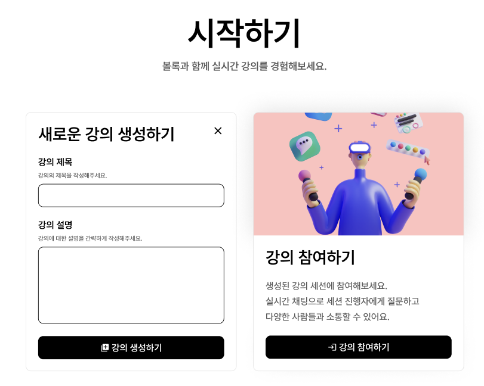
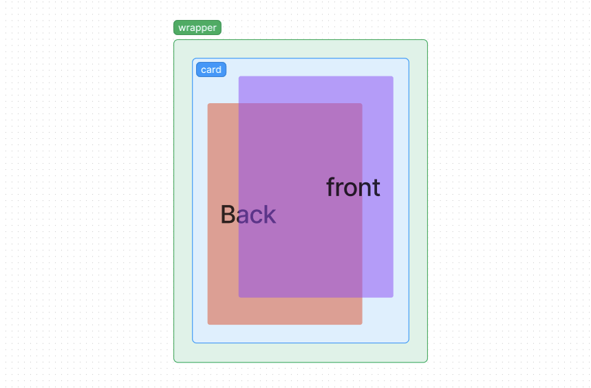

> 해당 글은 부스트캠프 웹・모바일 8기 멤버십 활동과 관련된 내용을 담고 있습니다.

<br/>

> **구현 결과물 미리보기**
>
> 

## 구현하고자 하는 것은?

프로젝트를 진행하며 가장 중요하게 생각했던 것은 **"복잡하게 구성하지 말자"**는 것입니다. 시간은 한정되어 있고, 짧은 기간 내에 프로젝트를 끝내야 했기 때문에 UI 구성을 최대한 단순하게 가져가는 것을 목표로 했습니다.

<br/>

메인 페이지를 디자인하는 과정에서 강의를 들을 수 있는 방을 개설하거나 개설된 방에 참여하는 UI를 단순히 보여주는 것으로 간단히 구성할 수 있었지만, 추가적인 정보를 전달해주고자 앞면에는 해당 기능에 대한 정보, 뒷면에는 기능과 관련된 요소가 존재하는 카드 형태를 구상하게 되었습니다.

<br/>



<br/>

버튼을 클릭하면 해당 요소가 바로 표시되도록 간단하게 구현이 가능했지만, **보다 동적인 느낌을 주고자** 카드를 뒤집는 것 같은 Flip 효과를 구현하게 되었습니다.

## 간단한 예제 구성하기

### html 뼈대 작성하기

`<div>` 2개를 겹쳐 하나의 카드로 묶어 이를 뒤집는 형태로 구현하고자 했습니다. 전체적인 구조는 아래와 같습니다.

<br/>

```html
<div id="wrapper">
  <div id="card">
    <div id="front" />
    <div id="back" />
  </div>
</div>
```

<br/>

각각 `card`는 2개의 `div`를 하나로 묶는 역할을, `front`와 `back`은 각각 카드의 앞면과 뒷면을 의미하는 것은 알겠습니다. 그런데 왜 `wrapper`로 한 번 더 감싸는걸까요? 각각의 역할을 살펴봅시다.

<br/>

- `wrapper` : 카드의 사이즈를 결정합니다. 해당 요소의 크기를 기준으로 카드 크기를 결정합니다. 추가적으로 해당 요소를 hover시에 하위의 card를 뒤집도록 할 수 있습니다.

- `card` : 해당 요소 내부에 front와 back이 겹쳐 존재하여 이를 뒤집는 것으로 카드를 뒤집는 애니메이션을 구현할 수 있습니다.

<br/>

`wrapper`는 카드의 크기를 결정하는 기준점이 됨은 물론, `hover`시에 카드를 뒤집고자 할때 필요합니다. 만일 `card`에 `hover`시에 카드를 뒤집게 된다면, 뒤집는 과정에서 `card`에 빈 공간이 생겨 `hover` 효과가 끊기는 경우가 발생할 수 있습니다. 그렇기에 전체를 감싸는 `wrapper`에게 `hover` 효과를 부여하여 하위 `card`가 뒤집히도록 구현한다면 `hover` 효과가 중간에 끊김을 방지할 수 있습니다.

<br/>

이 뿐만 아니라 `perspective` 속성을 추가하기 위해서 `wrapper`가 필요합니다. (이 부분은 뒤에서 설명하겠습니다.)

### css 추가하기



앞서 구성한 html 뼈대를 시각화하자면 위와 같습니다. 이제 각 부분에 css를 작성해 동작하도록 해보겠습니다.

<br/>

```css
.wrapper {
  // 요소의 크기를 여기서 결정
  perspective: 1000px;
}

.card {
  width: 100%;
  height: 100%;
  position: relative;
  transition: all 0.5s;
  perspective-origin: center;
  transform-style: preserve-3d;
}

.front {
  width: 100%;
  height: 100%;
  z-index: 2;
  position: absolute;
  backface-visibility: hidden;
}

.back {
  width: 100%;
  height: 100%;
  z-index: 1;
  transform: rotateY(180deg);
}
```

<br/>

- 상위에 `relative`를 지정하고 하위 요소 2개에 `absolute`를 지정하는 것으로 카드가 겹치도록 하였습니다.

- `back`은 `transform: rotateY(180deg);`를 적용하여 뒤집힌 상태로 겹쳐지도록 하였으며, 카드가 뒤집혔을 때 정상적으로 보이기 위해 해당 속성을 추가하였습니다.

- `front`가 `back`에 비해 앞에 위치해야 하기 때문에 `z-index`를 달리하여 `front`가 더 높은 값을 가지도록 하였습니다.

- `front`에 `ackface-visibility: hidden;`속성을 지정하여 뒤집었을 때, 뒷면이 `front`의 뒷면이 보이지 않도록 하여 `back`이 정상적으로 표시될 수 있도록 하였습니다.

- 카드가 뒤집히는 애니메이션을 사실적으로 표현하기 위해 `transform-style: preserve-3d;`를 `card`에 추가하였습니다. 해당 속성은 해당 컨테이너를 3D 공간에서 렌더링하도록 지정합니다.

- 관련하여 원근감을 줄 수 있는 `perspective: 1000px;`를 지정하였습니다. `perspective`의 값이 높을 수록 더욱 멀리서 보는 효과를 줄 수 있습니다.

- `perspective`와 같이 사용되는 `perspective-origin: center;`는 `perspective`의 기준점을 설정해줍니다. 중앙을 기준으로 효과를 줄 수 있도록 추가하였습니다.

<br/>

여기서 요소 내부의 특정 버튼을 클릭하거나 요소를 hover할 경우에 card에 아래 속성을 추가하는 것으로 카드를 뒤집을 수 있습니다.

<br/>

```css
// wrapper hover 시나 특정 이벤트 발생 시 카드 뒤집기
transform: rotateY(180deg);
```

<br/>

### 예제를 통해 확인하기

아래는 `code sandbox`에서 작성한 예제입니다.

<br/>

> **index.html**

```html
<!DOCTYPE html>
<html lang="en">
  <head>
    <meta charset="UTF-8" />
    <meta name="viewport" content="width=device-width, initial-scale=1.0" />
    <meta http-equiv="X-UA-Compatible" content="ie=edge" />
    <title>FLIP CARD</title>
    <link rel="stylesheet" href="styles.css" />
  </head>
  <body>
    <div class="wrapper">
      <div class="card">
        <div class="front">front</div>
        <div class="back">back</div>
      </div>
    </div>
  </body>
</html>
```

<br/>

> **styles.css**

```css
.wrapper {
  width: 200px;
  height: 400px;
  position: absolute;
  top: 50%;
  left: 50%;
  transform: translateX(-50%);
  transform: translateY(-50%);

  perspective: 1000px;
}

.wrapper:hover .card {
  transform: rotateY(180deg);
}

.card {
  width: 100%;
  height: 100%;
  position: relative;
  transition: all 0.5s;
  perspective-origin: center;
  transform-style: preserve-3d;

  color: white;
  font-size: 30px;
}

.front {
  width: 100%;
  height: 100%;
  z-index: 2;
  position: absolute;
  backface-visibility: hidden;

  background-color: violet;
  border-radius: 20px;
  overflow: hidden;
  display: flex;
  align-items: center;
  justify-content: center;
}

.back {
  width: 100%;
  height: 100%;
  z-index: 1;
  transform: rotateY(180deg);

  background-color: skyblue;
  border-radius: 20px;
  overflow: hidden;
  display: flex;
  align-items: center;
  justify-content: center;
}
```

<br/>


> [code sandbox 예제](https://codesandbox.io/p/sandbox/shy-cherry-zps4vy?layout=%257B%2522sidebarPanel%2522%253A%2522EXPLORER%2522%252C%2522rootPanelGroup%2522%253A%257B%2522direction%2522%253A%2522horizontal%2522%252C%2522contentType%2522%253A%2522UNKNOWN%2522%252C%2522type%2522%253A%2522PANEL_GROUP%2522%252C%2522id%2522%253A%2522ROOT_LAYOUT%2522%252C%2522panels%2522%253A%255B%257B%2522type%2522%253A%2522PANEL_GROUP%2522%252C%2522contentType%2522%253A%2522UNKNOWN%2522%252C%2522direction%2522%253A%2522vertical%2522%252C%2522id%2522%253A%2522clpi8x0im0007356hfxruieih%2522%252C%2522sizes%2522%253A%255B70%252C30%255D%252C%2522panels%2522%253A%255B%257B%2522type%2522%253A%2522PANEL_GROUP%2522%252C%2522contentType%2522%253A%2522EDITOR%2522%252C%2522direction%2522%253A%2522horizontal%2522%252C%2522id%2522%253A%2522EDITOR%2522%252C%2522panels%2522%253A%255B%257B%2522type%2522%253A%2522PANEL%2522%252C%2522contentType%2522%253A%2522EDITOR%2522%252C%2522id%2522%253A%2522clpi8x0im0003356hj8afuioq%2522%257D%255D%257D%252C%257B%2522type%2522%253A%2522PANEL_GROUP%2522%252C%2522contentType%2522%253A%2522SHELLS%2522%252C%2522direction%2522%253A%2522horizontal%2522%252C%2522id%2522%253A%2522SHELLS%2522%252C%2522panels%2522%253A%255B%257B%2522type%2522%253A%2522PANEL%2522%252C%2522contentType%2522%253A%2522SHELLS%2522%252C%2522id%2522%253A%2522clpi8x0im0004356h4a7ta44t%2522%257D%255D%252C%2522sizes%2522%253A%255B100%255D%257D%255D%257D%252C%257B%2522type%2522%253A%2522PANEL_GROUP%2522%252C%2522contentType%2522%253A%2522DEVTOOLS%2522%252C%2522direction%2522%253A%2522vertical%2522%252C%2522id%2522%253A%2522DEVTOOLS%2522%252C%2522panels%2522%253A%255B%257B%2522type%2522%253A%2522PANEL%2522%252C%2522contentType%2522%253A%2522DEVTOOLS%2522%252C%2522id%2522%253A%2522clpi8x0im0006356hml6g3ins%2522%257D%255D%252C%2522sizes%2522%253A%255B100%255D%257D%255D%252C%2522sizes%2522%253A%255B50.4291434373623%252C49.5708565626377%255D%257D%252C%2522tabbedPanels%2522%253A%257B%2522clpi8x0im0003356hj8afuioq%2522%253A%257B%2522tabs%2522%253A%255B%257B%2522id%2522%253A%2522clpi8x0im0002356hontfcfeh%2522%252C%2522mode%2522%253A%2522permanent%2522%252C%2522type%2522%253A%2522FILE%2522%252C%2522filepath%2522%253A%2522%252Findex.html%2522%252C%2522state%2522%253A%2522IDLE%2522%257D%255D%252C%2522id%2522%253A%2522clpi8x0im0003356hj8afuioq%2522%252C%2522activeTabId%2522%253A%2522clpi8x0im0002356hontfcfeh%2522%257D%252C%2522clpi8x0im0006356hml6g3ins%2522%253A%257B%2522id%2522%253A%2522clpi8x0im0006356hml6g3ins%2522%252C%2522activeTabId%2522%253A%2522clpi8z03u00a0356hyk1yfov7%2522%252C%2522tabs%2522%253A%255B%257B%2522type%2522%253A%2522UNASSIGNED_PORT%2522%252C%2522port%2522%253A0%252C%2522id%2522%253A%2522clpi8z03u00a0356hyk1yfov7%2522%252C%2522mode%2522%253A%2522permanent%2522%252C%2522path%2522%253A%2522%2522%257D%255D%257D%252C%2522clpi8x0im0004356h4a7ta44t%2522%253A%257B%2522tabs%2522%253A%255B%255D%252C%2522id%2522%253A%2522clpi8x0im0004356h4a7ta44t%2522%257D%257D%252C%2522showDevtools%2522%253Atrue%252C%2522showShells%2522%253Atrue%252C%2522showSidebar%2522%253Atrue%252C%2522sidebarPanelSize%2522%253A15%257D)

## 프로젝트에 적용하기

해당 코드를 바탕으로 프로젝트에 적용하였습니다. `tailwindCSS`를 활용하고 있었기에 지원하지 않는 요소들을 global로 작성하였습니다.

<br/>

```css
.preserve-3d {
  transform-style: preserve-3d;
}

.backface-hidden {
  backface-visibility: hidden;
}

.rotate-180 {
  transform: rotateY(180deg);
}

.perspective-1000 {
  perspective-origin: center;
  perspective: 1000px;
}
```

<br/>


<br/>

메인 페이지에는 카드가 2개 존재하며, 각 카드별로 state를 두어 뒤집혔는지를 판단하였습니다. 한 쪽이 뒤집힌다면, 다른 한 쪽은 다시 앞면을 보이도록 하며, 관련된 state들을 초기화하도록 하였습니다. 또한, 단순히 `hover`시에 뒤집히도록 처리하지 않고 버튼을 클릭한 경우에 `state`를 변화시켜 카드가 뒤집히도록 구현했습니다.

## 포스팅을 마치며

CSS로 생각보다 다양한 애니메이션을 구현할 수 있음을 느꼈습니다. 라이브러리가 없더라도 이번에 구현해본 수준의 효과는 충분히 쉽게 만들어낼 수 있었습니다. 이후 가능하다면 해당 부분을 모듈화하여 쉽게 활용이 가능하도록 코드를 분리해보는 것도 좋을 것 같습니다.

<br/>

글 읽어주셔서 감사드립니다. 혹여나 틀린 부분이나 미흡한 부분이 있다면 지적해주시면 감사드리겠습니다.

### 참고 자료

- [perspective와 backface-visibility](https://gahyun-web-diary.tistory.com/80)
- [CSS 3D 카드 뒤집기 애니메이션 효과 연출 방법](https://rgy0409.tistory.com/5052#google_vignette)
- [MDN perspective](https://developer.mozilla.org/en-US/docs/Web/CSS/perspective)
- [MDN backface-visibility](https://developer.mozilla.org/en-US/docs/Web/CSS/backface-visibility)
