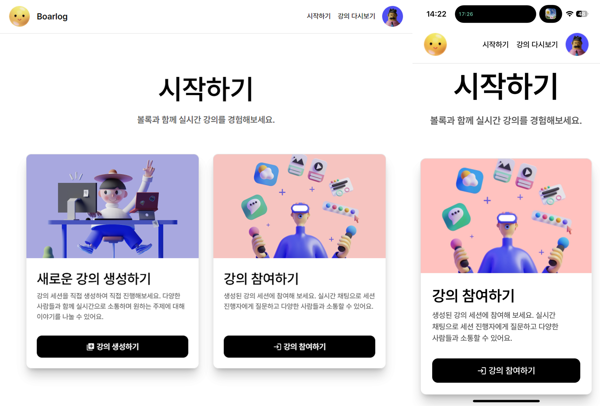
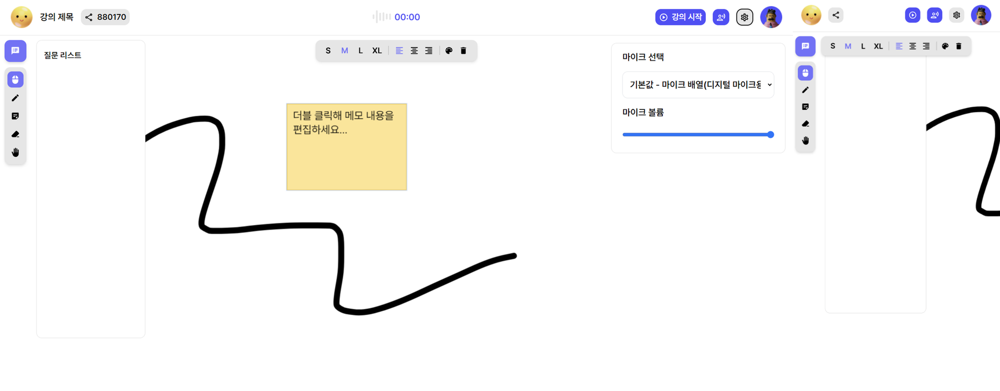
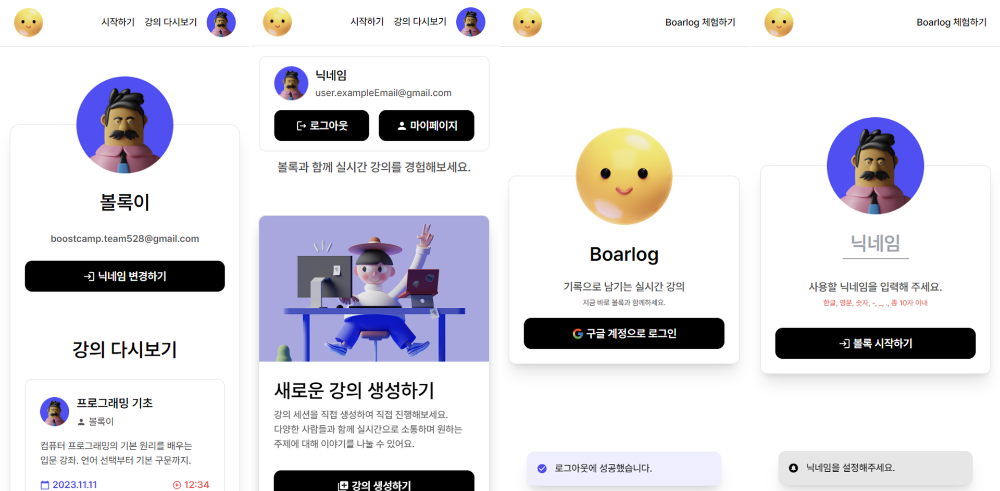
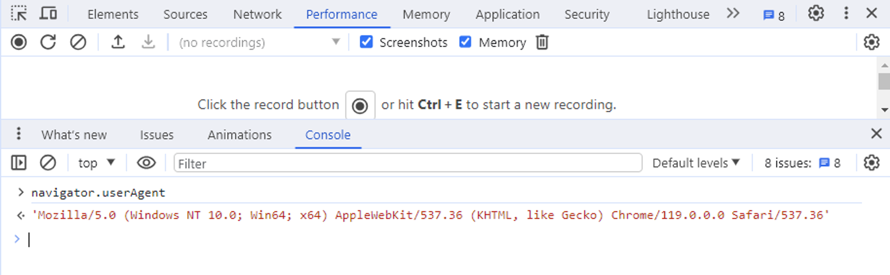
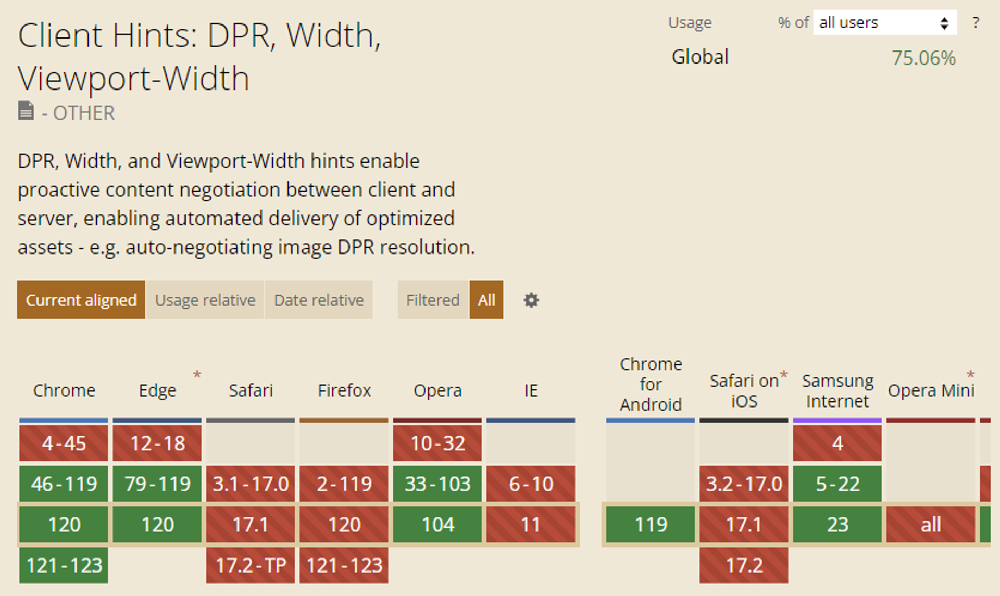
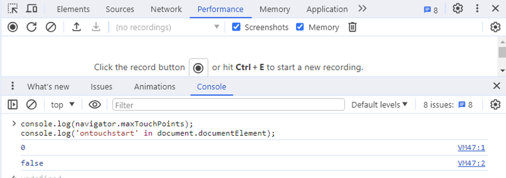
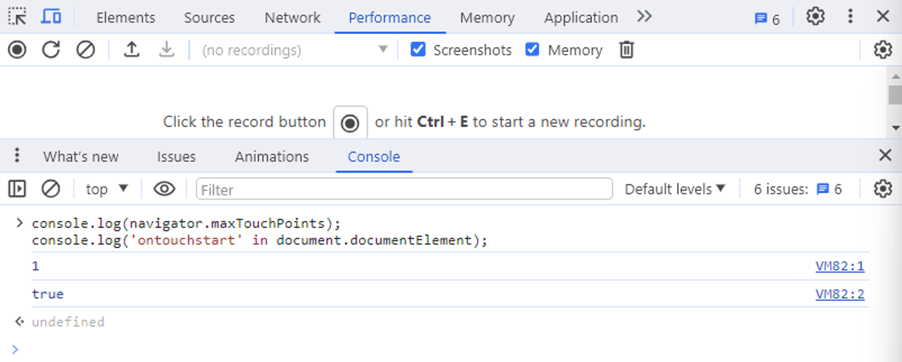
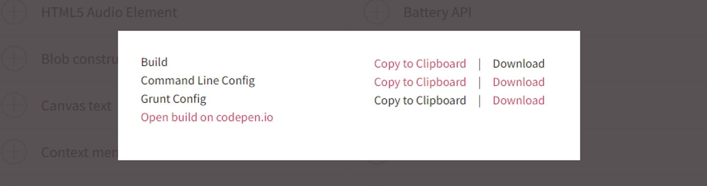

> 해당 글은 부스트캠프 웹・모바일 8기 멤버십 활동과 관련된 내용을 담고 있습니다.

<br/>

> **구현 결과물 미리보기**
>
> 

## 왜 모바일 차별하세요?

부스트캠프 그룹 프로젝트는 총 6주간 진행됩니다. 주어진 기간 안에 **최소한의 MVP를 목표로 개발하는 것이 하나의 챌린지**이기 때문에 서비스에 있어서 상대적으로 중요하지 않은 부가적인 부분들은 제외하는 것이 옳다고 생각했습니다.

<br/>

다른 캠퍼분들과 각 팀에서 개발하고 있는 서비스를 소개하는 과정에서 저희 서비스가 모바일에서도 이용할 수 있으면 좋을 것 같다는 의견을 주셨습니다. 이를 바탕으로 대부분의 UI는 `media query`를 이용하여 반응형으로 동작할 수 있도록 작업하였으나, 문제는 **강의자 페이지**였습니다.

### 강의자 페이지가 왜?

강의자 페이지는 아래와 같은 기능들을 포함하고 있습니다.

<br/>

> **강의자 페이지 주요 기능**
>
> - 화이트보드에 펜으로 그림을 그릴 수 있습니다.
> - 화이트보드에 포스트잇을 생성해 텍스트를 입력할 수 있습니다.
> - 음성을 참여자들에게 전달할 수 있습니다.
> - 참여자들이 보낸 질문들을 확인하고 이를 포스트잇으로 붙여넣을 수 있습니다.

<br/>



<br/>

이러한 모든 기능들이 모바일에서도 문제없이 잘 동작하도록 구현하는데 많은 시간을 소요할 것이라 예상하였습니다. 강의자 페이지에서 사용자에게 보여줘야 할 요소들이 많았고, 핵심이 되는 화이트보드는 화면이 작아질 수록 그만큼 활용할 수 있는 크기가 작아지기 때문이기도 합니다.

<br/>



<br/>

다만, 다른 페이지들은 논외에 해당합니다. 충분히 모바일 환경에서도 이용하기에 무리가 없다고 생각하여 강의자 페이지와 같은 **특정 페이지만 모바일의 접근을 제한**하기로 하였습니다.

## 그런데, 어떻게 제한하지?

모바일 기기의 접근을 제한하기 위해서는 우선 접근한 기기가 모바일인지, PC인지를 판단할 필요가 있었습니다. 이를 어떻게 구분할 수 있을지 다양한 방법을 찾아봤습니다.

### 방식 1: userAgent

MDN의 userAgent에 대한 설명을 참고하자면 아래와 같습니다.

<br/>

> [**MDN - userAgent**](https://developer.mozilla.org/ko/docs/Glossary/User_agent)
>
> 사용자 에이전트(user agent)는 사용자를 대표하는 컴퓨터 프로그램으로, [웹](https://developer.mozilla.org/ko/docs/Glossary/World_Wide_Web) 맥락에선 [브라우저](https://developer.mozilla.org/ko/docs/Glossary/Browser)를 의미합니다. … 브라우저는 서버에 보내는 모든 요청에 사용자 에이전트(UA) 문자열이라고 부르는, 자신의 정체를 알리는 [`User-Agent` (en-US)](https://developer.mozilla.org/en-US/docs/Web/HTTP/Headers/User-Agent) [HTTP](https://developer.mozilla.org/ko/docs/Glossary/HTTP) 헤더를 보냅니다. 이 문자열은 보통 브라우저 종류, 버전 번호, 호스트 운영체제를 포함합니다.

<br/>



<br/>

`userAgent`의 값은 쉽게 확인할 수 있습니다. 현재 브라우저의 console에서 `navigator.userAgent`로 접근하여 확인이 가능합니다. `userAgent`로 확인이 가능한 각각의 값은 아래와 같습니다.

<br/>

```jsx
userAgent = appCodeName/appVersion number (Platform; Security; OS-or-CPU;
Localization; rv: revision-version-number) product/productSub
Application-Name Application-Name-version
```

<br/>

여기에서 `Platform`과 `OS` 등을 확인해 충분히 모바일 환경인지를 파악할 수 있습니다. 특정 문자열이 `userAgent` 값에 포함이 되어있는지의 여부를 바탕으로 아래와 같이 간단하게 판단이 가능합니다.

<br/>

```jsx
if (/Android|iPhone/i.test(navigator.userAgent)) {
  console.log("모바일 환경입니다.")
}
```

<br/>

다만, MDN에서도 `userAgent`를 활용하여 접근 기기를 판단하는 방식을 권장하고 있지 않습니다.

<br/>

> ⚠️ Browser identification based on detecting the user agent string is **unreliable** and **is not recommended**, as the user agent string is user configurable.

<br/>

이에 대한 예시로 Firefox나 Opera와 같은 브라우저에서는 해당 값을 사용자의 의도에 따라 자유롭게 변경이 가능한 경우도 있습니다. 단편적인 예시로 모바일 브라우저가 있겠습니다.

<br/>


<br/>

현재 접속한 페이지는 로드될 때 `console.log(window.navigator.userAgent)`를 실행하도록 하였습니다. 좌측은 단순히 특정 페이지를 모바일 크롬 브라우저로 접속했을 때에 해당합니다. `Platform`에서 볼 수 있듯이 `iPhone`으로 모바일인지 판단이 가능합니다. 다만, 브라우저 옵션에서 데스크톱 화면으로 보기 기능을 활성화한 경우에는 문제가 발생합니다.

<br/>

우측을 해당 기능을 활성화한 상태에서 접근하면 `Macintosh`로 `Platform`이 잡히는 것을 볼 수 있습니다. 너무나도 쉽게 클라이언트 혹은 사용자가 변조할 수 있기 때문에 `userAgent`로 사용자의 기기를 판단하는 것은 그리 좋은 방식은 아니라 판단하였습니다.

<br/>

> **UA Spoofing**
>
> 위에서 언급한 `userAgent`를 조작하는 행위를 UA 스푸핑이라 칭합니다. 실제 브라우저 정보를 숨기는 방식으로 보안을 강화하거나 개발 과정에서 테스트를 위해서 이를 사용하는 경우가 있습니다.

<br/>

또한 실질적으로 `userAgent`의 점진적 삭제가 진행되었습니다. OS 이름과 버전, 브라우저 이름과 버전을 담고 있기 때문에 개인 정보 보안을 강화하기 위해 이러한 정책이 시작되었습니다.

<br/>

> **[Chrome 100의 지원 중단 및 삭제  |  Blog  |  Chrome for Developers](https://developer.chrome.com/blog/deps-rems-100?hl=ko)**

### 방식 2: Client Hint

개인정보 침해 문제가 있을 수 있는 `userAgent`를 대신하여 Chrome에서 제시하는 새로운 샌드박스 프로젝트 중 하나인 `Client Hint`가 있습니다. `userAgent`와는 다르게 상세한 정보를 제공하는 방식이 아닌 필요한 정보만 선택적으로 요청하고 제공할 수 있습니다.

<br/>

> **[Client hints(클라이언트 힌트) - HTTP | MDN](https://developer.mozilla.org/ko/docs/Web/HTTP/Client_hints)**

<br/>

`https` 환경에서만 지원하며, `userAgent`와는 다르게 `Accept-CH`를 선언해주는 것으로 적용할 수 있습니다.

<br/>

```jsx
<meta
  http-equiv="Accept-CH"
  content="DPR, Width, Viewport-Width, Downlink ..."
/>
```

<br/>

`content`에 특정 값들을 추가하여 요청할 사용자의 정보를 정의할 수 있습니다. 일부 속성들에 대해 간단하게 정리하자면 아래와 같습니다.

<br/>

> **Client Hint의 속성들**
>
> - `device-memory`: 디바이스의 사용 가능 메모리 (시스템 RAM과는 다름)
> - `dpr`: device pixel ratio
> - `width`: 이미지일 경우의 viewport 상에서 DRP가 적용된 px width
> - `viewport-width`: css px 단위의 viewport width
> - `rtt`: round-trip time
> - `Downlink`: 추정 다운로드 속도
> - `ect`: 추정 connection type

<br/>

여기서 모바일임을 판단할 수 있는 다양한 척도 중 하나는 `dpr`이라 생각했습니다.

<br/>

> **DPR란?**
>
> `dpr`은 `Device Pixel Ratio`의 줄임말로, 브라우저 상에서의 단일 픽셀을 그리는 데 물리적인 픽셀이 몇 개가 필요한지에 대한 값을 의미합니다.

<br/>

일반적으로 모바일 장치는 2 혹은 3 이상의 높은 DPR 값을 가지게 됩니다. 과거에 비해 유사한 화면 크기를 유지하며 해상도가 높아졌기 때문에 픽셀 밀도가 높아졌기 때문에 이러한 차이가 생기게 됩니다. 일반적인 PC 모니터의 경우는 대부분 DPR이 1에 해당하기 때문에 이러한 값을 기준으로 모바일인지를 판단할 수 있을 것이라 생각하였습니다.

<br/>

> **여담**
>
> 애플 제품군에서 쉽게 볼 수 있는 Renita 디스플레이는 픽셀 밀도가 2배 이상 되는 디스플레이를 의미합니다.
>
> [HD & Retina Display Media Queries](https://medium.com/@micjamking/hd-retina-display-media-queries-b5562b5430d6)

<br/>



<br/>

다만, `Client Hint`는 아직 모든 브라우저에서 지원하지는 않습니다. `Can i use`를 통해 확인해본 `Client Hint`는 아직 Safari와 Firefox 브라우저에서는 지원하지 않습니다. 만약 서비스가 IE까지 지원할 필요가 있는 경우라면 더더욱 사용이 힘들 것이라 생각되었습니다.

<br/>

> [User-Agent Client Hints](https://wicg.github.io/ua-client-hints/)

<br/>

또한 아직까지 `Client Hint`는 W3C(World Wide Web Consortium)로부터 아직 인정받은 표준은 아닌 것으로 파악하였습니다. 이러한 점을 고려하여 다른 방식으로 접근 기기를 판단하기로 하였습니다.

### 방식 3: Modernizr

모바일 기기와 PC를 구분짓는 가장 큰 차이점이 하나 존재했는데 이를 망각하고 있었습니다. 바로 `touchEvent`입니다. 일반적으로 요즘 모바일 기기는 터치 스크린이 존재하기 때문에 터치 이벤트를 지원하는지를 파악하여 모바일 기기인지 아닌지를 판단할 수 있습니다. 이를 단순히 구현하자면 아래와 같습니다.

<br/>

```jsx
console.log(navigator.maxTouchPoints) // 최대 터치 포인트 수 확인
console.log("ontouchstart" in document.documentElement) // 터치 이벤트 지원 여부 확인
```

<br/>



<br/>

위 코드를 PC 환경에서 실행했을 경우에는 다음과 같은 출력값을 보여줍니다. 그렇다면 해당 코드로 간단하게 모바일임을 판단할 수 있을까요?

<br/>



<br/>

동일한 PC 브라우저이지만 모바일 뷰로 확인했을 경우에는 이전과 달리 터치 이벤트를 지원하는 것처럼 값이 출력됨을 확인할 수 있습니다. 이러한 점을 고려했을 때, 해당 코드만으로 터치 이벤트를 판단하는 것은 모바일 기기를 완전히 구분하기에는 힘들 수 있겠다는 생각이 들었습니다.

<br/>

또한 일부 최신 노트북의 경우, 터치 스크린을 가지고 있는 경우도 있어, 이러한 기기까지 모바일로 판단할 수도 있겠습니다. 그렇다면 하나의 요소만으로 모바일을 판단하는 것보다는 지금까지 고려했던 다양한 요소들을 종합적으로 판단하여 모바일인지를 확인하는 것이 합리적일 것 같습니다.

<br/>

다만, 이러한 요소들을 하나씩 브라우저에 맞추어 판단할 수 있는 코드를 작성한다면 모바일 기기임을 판단하는 코드를 작성하는데 많은 시간이 소요될 것입니다. 이러한 점을 고려하여 저희 프로젝트에서는 `Modernizr`를 도입하는 것을 고려하였습니다.

## Modernizr 적용기

`Modernizr`는 어떤 CSS3와 HTML5 기능들을 사용할 수 있는지를 쉽게 테스트할 수 있는 라이브러리입니다. 원하는 이벤트 혹은 기능들만을 선택해 해당 기능들을 현재 환경에서 지원하는지를 테스트할 수 있어 이를 바탕으로 모바일임을 판단할 수 있을 것이라 생각하여 `Modernizr` 적용을 시도하였습니다.

<br/>

다만, 현재로서는 다양한 기능들을 고려하여 모바일 환경인지를 판단하는 기준이 명확하지 않아 우선 터치 이벤트만을 판단하는 방식으로 `Modernizr`를 적용하였습니다. 이후 추가적인 기능들을 테스트하여 모바일 기기 판단의 정확도를 높일 수 있을 것이라 생각합니다.

### Modernizr 파일 생성하기

> **[Modernizr Download Builder](https://modernizr.com/download?setclasses)**

<br/>

`Modernizr`를 적용하기 위해 상단 링크를 통해 `Modernizr` 파일을 다운받을 수 있습니다. `Modernizr`를 이용해 체크하고 싶은 요소들을 체크하여 `modernizr-custom.js`파일을 빌드합니다.

<br/>




해당 파일을 다운로드하여 프로젝트에 위치 시킵니다.

### Modernizr 적용하기

파일의 위치는 크게 상관없으나, 저희 프로젝트에 적용하는 과정에서는 `src`폴더 하위에 위치시켰습니다. (React, Vite 프로젝트입니다.) 전역으로 어디에서나 `Modernizr`를 사용하기 위해 `index.html`에 `script` 태그를 이용하여 추가한 파일을 불러옵니다.

<br/>

```jsx
<script type="text/javascript" src="/src/modernizr.js"></script>
```

<br/>

전역으로 적용한 이후에는 `Modernizr`를 사용하고 싶은 파일에서 아래와 같이 활용이 가능합니다.

<br/>

```jsx
console.log(Modernizr.touchevents) // 터치 이벤트 지원 유무 true/false
```

<br/>

현재 프로젝트에서는 강의 생성과 관련된 기능들을 모바일 기기에서는 제한하고자 하였습니다. 이를 이용하여 아래와 같이 작동하도록 작업하였습니다. 현재는 단순히 터치 이벤트를 기준으로 판단하였기 때문에 모바일 뷰에서 페이지를 로드했을 경우에 ‘새로운 강의 생성하기’ 카드가 제거되는 모습을 볼 수 있습니다.

<br/>


### 번외) Modernizr type 설정하기

현 프로젝트에서 `TypeScript`를 사용하고 있기 때문에 `Modernizr`에 대한 type을 지정해줄 필요가 있습니다. type을 지정해주기 위한 `modernizr.d.ts`를 새로 생성하여 아래와 같이 type을 지정해주었습니다.

<br/>

```jsx
declare global {
  interface ModernizrStatic {
    touchevents: boolean;
  }
  let Modernizr: ModernizrStatic;
}

export {};
```

<br/>

이를 적용하기 위해 `tsconfig.json`에 다음을 추가하여 type 지정을 완료하였습니다.

<br/>

```jsx
"include": ["src/**/*", "src/global.d.ts"],
```

## 포스팅을 마치며

모바일 기기일 경우에 특정 기능을 제한하고 싶다는 생각부터 시작해 다양한 개념들을 학습할 수 있었습니다. 현재 적용한 `Modernizr`는 가장 기초적인 형태이기 때문에 이를 고도화한다면 더 많은 기기에서 다양한 기능들에 대해 대응이 가능할 것 같습니다.

<br/>

부족한 글 읽어주셔서 감사드립니다. 혹여나 틀린 부분이 있다면 지적해주시면 감사드리겠습니다.

### 참고 자료

- **[UA 대신에 Client Hints 사용해보기](https://frontdev.tistory.com/entry/UA-%EB%8C%80%EC%8B%A0%EC%97%90-Client-Hints-%EC%82%AC%EC%9A%A9%ED%95%B4%EB%B3%B4%EA%B8%B0)**
- [**MDN(KR)-Client Hint**](https://developer.mozilla.org/ko/docs/Web/HTTP/Client_hints)
- **[Chrome 100-User Agent 지원 중단 예정](https://developer.chrome.com/blog/deps-rems-100?hl=ko)**
- [**MDN(KR)-User Agent**](https://developer.mozilla.org/ko/docs/Glossary/User_agent)
- **[MDN(US)-User Agent](https://developer.mozilla.org/en-US/docs/Glossary/User_agent)**
- **[Naver D2-User-Agent Client Hints의 도입](https://d2.naver.com/helloworld/6532276)**
- **[Modernizr](https://modernizr.com/download?setclasses)**
