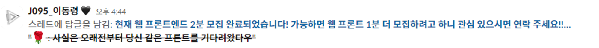
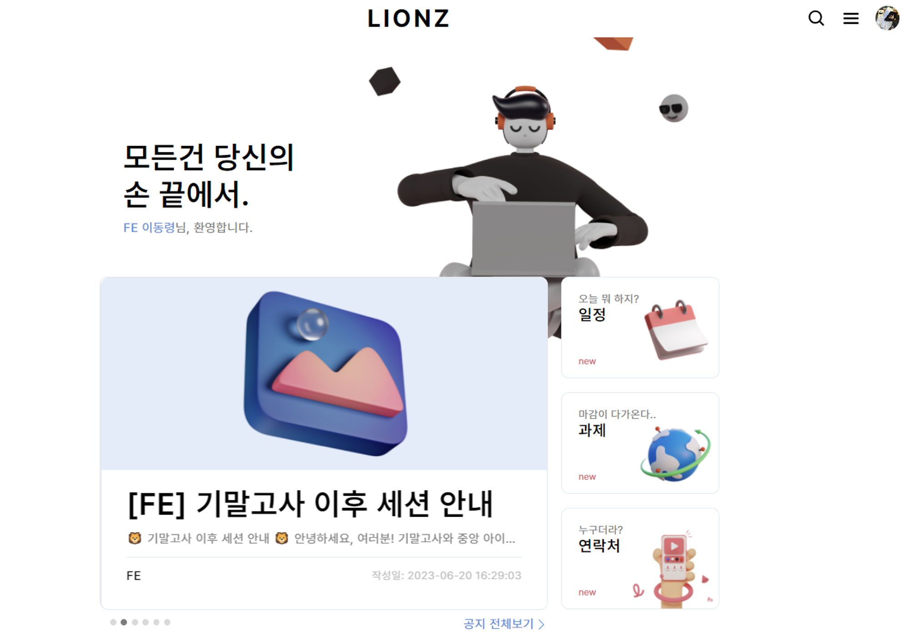
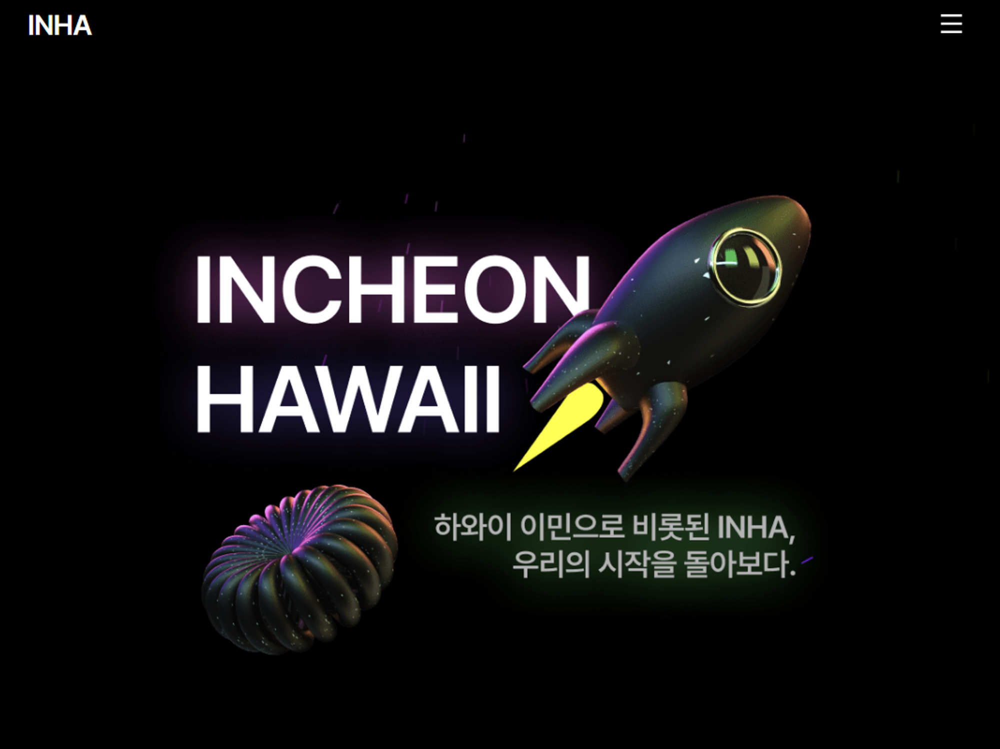
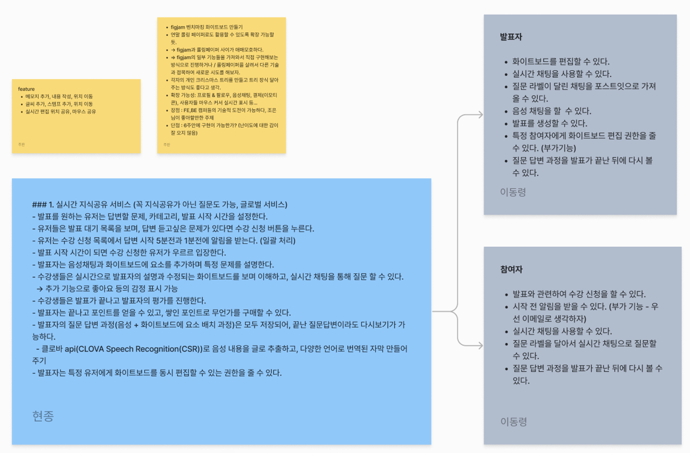

> 해당 글은 부스트캠프 웹・모바일 8기 멤버십 활동과 관련된 내용을 담고 있습니다.

## 그룹 프로젝트의 시작

부스트캠프 웹・모바일 8기에 지원하고, 챌린지 과정을 거쳐 멤버십까지 정말 순식간에 지나간 2023년 하반기입니다. 두 번의 학습 스프린트를 끝마치고 그룹 프로젝트만 남아있는 지금, 이 순간을 기록으로 남깁니다.

 

이번 포스팅은 저희 팀에 대한 소개와 더불어 그룹 프로젝트의 주제 선정 과정에 대해 다루고자 합니다. 프로젝트를 진행함에 있어 가장 큰 일들 중 하나인 ‘주제 선정’과 관련하여 어떠한 고민들을 중심으로 이야기를 나누었고, 그 과정에서 어떠한 결론을 도출해냈는지에 대해 공유드리고자 합니다.

## 팀 소개

### 우리는 무엇에 집중하고자 하는가?

어떤 집단이라도, 집단 크기가 다르고 성격도 다르더라도 공통적으로 모든 집단 구성원들이 가지고 있는 “목표”가 존재합니다. 그 목표가 얼마나 명확한지, 어떠한 목표를 가지고 있는지에 따라 집단의 방향성이 결정되는 만큼 **우리는 어떠한 목표를 가지고 있는가**에 대해 생각해보는 것이 중요하다고 생각합니다.

 

저는 이전까지 몇 가지 토이 프로젝트 혹은 해커톤을 경험하며 “그래서 이러한 프로젝트를 통해 어떤 것을 얻었는가?”라고 누가 질문을 던진다면 명확히 답변할 자신이 없었습니다.

 

해커톤에 참여하기 위한 프로젝트의 경우, 단기간 안에 빠르게 구현해내는 것이 1순위였기에 우리가 활용한 기술 혹은 라이브러리가 정확히 어떤 역할을 하고, 어떠한 방식으로 작동하는지에 대해 생각해보지 못했습니다. 열심히 시간을 투자해 구현을 마친다고 하더라도 실질적으로 해커톤 데모데이 당일에만 사용되고 버려질 프로젝트가 대부분이었기에 실질적으로 사용할 수 있는 프로젝트를 진행해보고 싶다는 열망이 생겼습니다.

그래서 동아리 내부에서 활용할 수 있는 **공지/과제 제출 플랫폼 Lionz**와 다양한 사람들이 사용해볼 수 있는 **인하대학교 2023 비룡제 홈페이지**를 구상하여 프로젝트를 진행하였습니다. 해당 프로젝트들을 통해서 다음과 같은 경험을 할 수 있었습니다.

 

> **위 프로젝트들을 통해 경험한 것들**
>
> - 프로젝트 기획 과정의 중요함을 깨달았습니다. 모호하게 정의된 각각의 기능들은 이후 발생하는 변경사항들을 적용하고 고민하는 과정에 많은 시간을 투자하도록 하였습니다.
> - 프로젝트를 마치고 그만두는 것이 아니라 일부 개선 과정을 경험하였습니다. 모바일 환경에서의 접근성 고려와 더불어 일부 기능들의 경우, 정상 작동하지 않거나 오류가 발생했을 경우에 추가적인 처리와 개선 작업을 진행하였습니다.

 

다만, **내가 이 기술을 왜 선택했고, 어떠한 고민들을 했는가?** 에 대해서는 여전히 생각해보지 못했습니다.

### 우리만의 규칙 정하기

저희 팀은 **기술적인 deep dive를 경험하자**가 모든 구성원이 긍정하는 공통된 목표였습니다. 이전까지 기술적인 고민들을 많이 시도해보지 못했고, 이러한 경험을 꼭 가져가고 싶다는 의견이 일치했기에 주된 목표로 선정하였습니다. 이전과는 다른 방식으로 프로젝트를 진행하게 되어 설레이는 감정도 있었지만 한 켠에는 시도해보지 않았던 목표이기에 무리없이 진행할 수 있을지에 대한 막연한 두려움도 있었습니다.

 

기술적인 고민과 더불어 깊은 학습을 위해서는 ‘우리가 왜 이 기술을 택했는지’에 대한 논의 과정이 반드시 필요합니다. 이 과정에서 특정 기능을 구현하기 위해 다양한 기술 혹은 라이브러리를 찾아보게 되고, 어떤 것을 사용할지에 대해 의견을 나누는 과정에서의 충돌도 생길 수 있습니다.

 

그렇기에 팀 안에서 서로를 존중하며 소통하기 위한 팀 규칙을 정했습니다. 특히나 소통이 가장 중요하다고 생각했기 때문에 ‘솔직함’을 가장 중요한 가치로 생각하였습니다. 내 상태를 객관적으로 파악하고 팀원들에게 공유하는 것, 내가 어떤 것을 모르고 어떤 것을 아는지 확실히 하고 팀원들과 의문점에 대해 논의하는 것에 있어서 필수적인 요소라 생각했기 때문입니다.

 

> **우리들의 규칙**
>
> - 지구 종말 상황에도 빠르게 연락을 나눌 수 있는 핫라인을 만들고 잘 유지하자.
> - 30분 이상 해결되지 않는 고민은 팀원들과 논의하자.
> - 꼭 **건강하자**. (자신의 상태에 대해 솔직하게 공유하자. ~~거짓말은 죽음 뿐이다~~)
> - 다른 조의 진행 상황을 보면서 초조해하지 않기로 하자. (~~우리가 최고다!~~)
> - 오프라인으로 만나면 **사진**으로 남기자.

### TEAM_528

이러한 팀 문화를 바탕으로 TEAM_528이 결성되었습니다. **`528`**은 팀원 5명의 캠퍼 번호를 더한 숫자로, 5명의 캠퍼가 서로 다른 기술, 경험, 및 아이디어를 결합하여 시너지를 발휘하고자 하는 뜻을 담고 있습니다.

## 주제 선정 과정

우리가 이번 프로젝트를 통해 가져가고자 하는 것은 무엇인지를 중심으로 주제를 고민하였습니다. 주제 선정 과정에서 항상 고민하게 되는 부분들이 있습니다.

 

> **고민거리들**
>
> - 이미 있는 서비스인데… 의미가 없지 않을까?
> - 조금 더 색다른 아이디어는 없을까?
> - 이걸 개발할 수 있을까?

 

특히나 이미 존재하거나 유사한 서비스들이 있기에 새롭게 프로젝트를 시작하는 시점에는 색다른 아이디어 혹은 추가 기능 등을 생각하기 마련입니다. 다만, 저희 팀의 목표는 **기술적인 성장**이기에 다른 방식으로 생각하기로 했습니다.

 

> **새로운 고민들**
>
> - 이 서비스에는 어떤 기능들이 메인일까?
> - 이 기능들을 구현한다면 **어떤 기술들이 필요할까?**
> - 이 프로젝트를 통해 **우리는 무엇을 얻어갈 수 있을까?**

유사한 서비스가 있다고 하더라도 이를 직접 기획하고 설계하는 과정을 거쳐 직접 구현해보는 것에 의의가 있다고 생각했습니다. 유저들이 자유롭게 이용할 수 있는 커뮤니티형 서비스의 경우, 기술적으로 크게 도전할 수 있는 메인 기능을 정하기 어려울 것으로 판단하여 제외하기로 결정하였습니다.

### 우리가 결정한 주제

기술적인 면에서의 도전할 수 있는 기능들을 중심으로 구상하여 각각의 장단점을 생각해본 결과, 저희는 Figjam과 유사한 형태의 서비스를 구현해보고자 결정하였습니다. 부스트캠프 커뮤니티 내에서도 사용할 수 있도록 여기에 추가적인 기능들을 구상하여 **실시간 화이트보드 강의 서비스**를 주제로 결정하였습니다.

 

프론트엔드, 백엔드 파트 전부 기술적으로 도전할 수 있는 주제이기도 하며, 추후에 확장 가능한 기능들을 쉽게 구상할 수 있다는 점이 큰 장점이었습니다. 개발자 커뮤니티에서도 지식 공유를 위해 간단하게 사용할 수 있어 프로젝트를 완성하고 이를 실제로 직접 사용해볼 수 있다는 점도 주제로 선정하게 된 이유이기도 합니다.

 

> **우리 서비스의 핵심 기능들**
>
> - 화이트보드를 자유롭게 편집할 수 있어야 한다.
> - 음성 채팅과 실시간 채팅도 고려해보자.
> - 이를 로그 형태로 남겨 다시 볼 수 있도록 하자.

 

저희 팀의 도전은 지금부터 시작입니다. 이번 프로젝트가 모두에게 있어 도약을 위한 도전이 될 수 있도록 노력해보고자 합니다.

 

> **항상 적극적으로 프로젝트에 참여해주신 우리 팀원분들께 감사의 말을 전합니다.**
