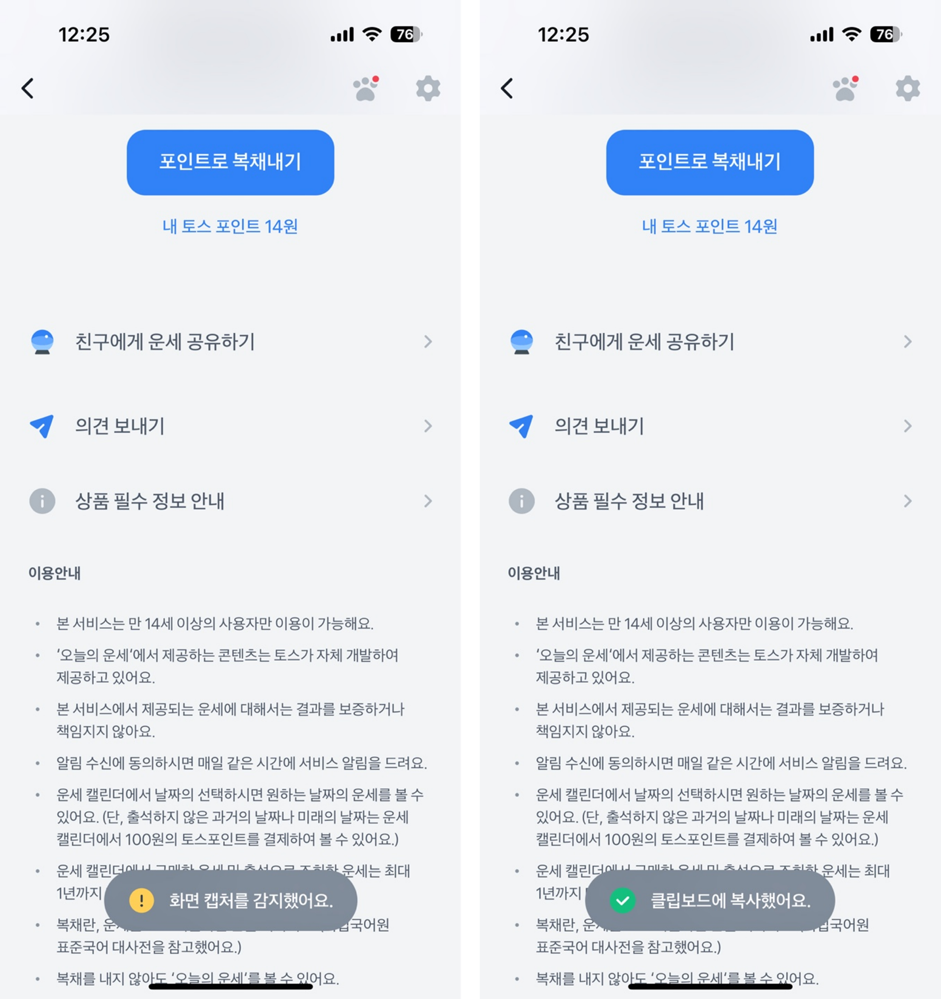
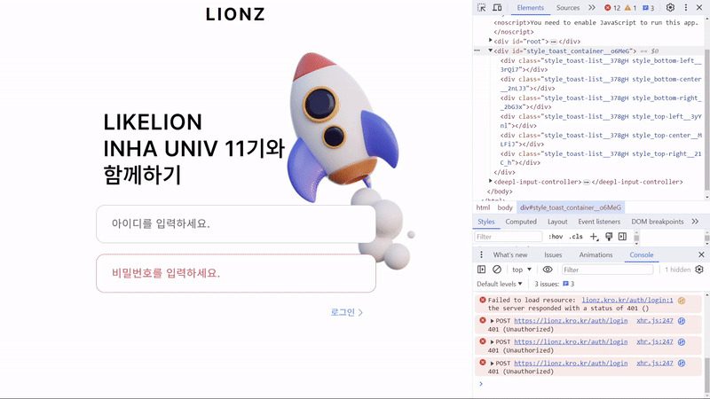
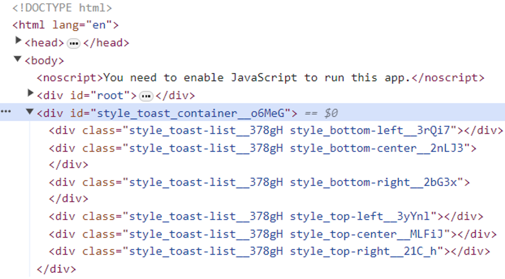
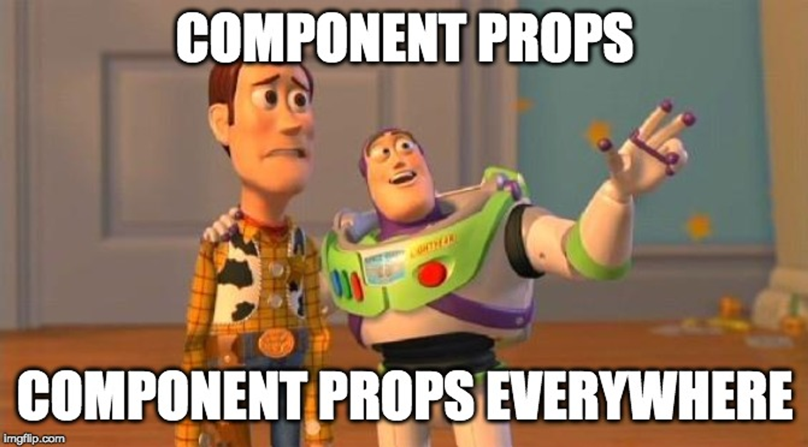
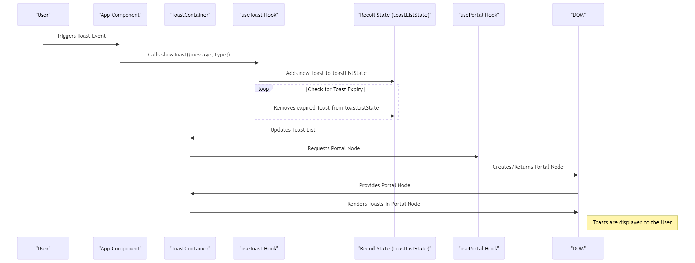

> 해당 글은 부스트캠프 웹・모바일 8기 멤버십 활동과 관련된 내용을 담고 있습니다.

<br/>

> **구현 결과 미리보기**
>
> 

## 포스팅에 앞서

일반적인 서비스에서 항상 필요로 하는 요소들 중 하나인 Toast를 어떻게 현재 프로젝트에서 사용할지에 대해 고민이었습니다. 이전까지 참여했던 프로젝트에서는 대부분 Toast 라이브러리를 활용했기에 이번에는 직접 Toast를 구현하기로 결정하였습니다.

<br/>

이번 포스팅은 Toast를 어떻게 구현하였는지, 구현한 Toast가 어떤 과정을 통해 동작하는지와 관련된 내용을 담고 있습니다. Toast를 직접 구현하고자 하는 분들에게 도움이 될 수 있기를 바랍니다.

### Toast가 뭔데?

Toast는 쉽게 말해 휴대전화의 알림창과 유사한 요소입니. 특정 동작에 대한 간단한 내용을 팝업하여 잠시 보여주고 사라지는 형태에 해당됩니다. 토스트기에서 빵이 튀어오르는 모습과 동일해 Toast라는 이름을 가지고 있습니다. 이러한 Toast는 서비스를 사용하는 과정에서 아주 쉽게 만나볼 수 있습니다.



아이디를 입력하지 않았거나, 로그인이 정상적으로 진행되는 등 특정 작업들에 대한 성공 여부를 사용자에게 가볍게 전달하기에 효과적이기 때문에 자주 사용됩니다.

## Toast 구현 이전의 고민들

위와 같은 Toast를 프로젝트에서 활용할 때는 이전까지 `react-simple-toasts` 등의 라이브러리를 사용하였습니다. 직접 구현하기에 앞서 `react-simple-toasts`는 어떻게 동작하는지를 다시 확인해보았습니다.

<br/>

> **[react-simple-toasts github repository](https://github.com/almond-bongbong/react-simple-toasts)**

<br/>



<br/>

> **[react-simple-toasts 활용 예제 프로젝트](https://github.com/lionz-11/lionz-inha)**

<br/>



<br/>

우선 `root` 내부에서 Toast를 관리하는 것이 아닌, 바깥에서 관리하는 것을 확인할 수 있습니다. 또한 Toast의 위치별로 container를 두어 Toast 생성 시에 해당 `div` 태그 내부에서 생성하도록 함을 확인할 수 있었습니다. 또한 특정 시간이 지나면 생성한 요소를 다시 삭제하여 각 container는 비어있는 상태를 유지하도록 동작하고 있습니다.

<br/>

이러한 동작 과정을 바탕으로 아래와 같은 고민에 대한 답을 얻을 수 있었습니다.

### 고민 1: 전역으로 관리해야 하는가?

Toast는 페이지 곳곳에서 사용됩니다. 버튼을 클릭하거나, 특정 페이지로 이동했을 경우 등 다양한 event와 연결지어 사용자에게 정보를 전달해주는 역할을 담당하고 있습니다. Toast의 내용을 지역적으로 관리할 경우, component의 형태로 각 페이지마다 가져와 사용해야 합니다.

<br/>

다만, 페이지에서 페이지로 이동하는 과정에서 Toast를 사용하게 된다면 어떻게 될까요? 페이지 전체가 새로 그려지기 때문에 당연히 이동하기 전 페이지에서 ‘환영합니다’와 같은 메세지를 Toast로 전달한다고 하더라도 이후 페이지로 이동하면서 Toast가 사라지게 될 것입니다.

<br/>

또한 각 페이지마다 state를 각각 만들어 관리해야 하기 때문에 복잡해지는 것은 물론, 페이지의 하위 component에서 Toast를 사용하기 위해 state를 prop로 전달해주는 과정에서의 prop dilling도 문제가 될 수 있습니다.

<br/>



<br/>

> **prop drilling이란?**
>
> prop를 하위 component로 전달하는 용도로만 사용되는 component를 거치면서 데이터를 전달하는 과정에 해당합니다. 단순히 1개에서 2개 정도를 거치는 수준이면 문제가 되지 않지만, component의 부모 자식 관계의 깊이가 깊어질 수록 거치는 component의 수도 많아지기 때문에 추적이 어려워집니다.

<br/>

이러한 Toast state를 전역에서 관리해준다면 문제를 해결할 수 있습니다. 공통된 state를 공유하기 때문에 각 페이지에서 state를 따로 가지고 있을 필요도 없으며, 하위로 전달해줄 state가 없기 때문에 Toast state와 관련된 prop drilling을 신경쓰지 않을 수 있습니다.

### 고민 2: 부모 트리 밖에서 그려야 하는가?

일반적으로 React에서 element는 `root` 하위의 DOM 계층 구조의 자식으로 렌더링됩니다. 다만, Toast는 ‘알림’의 기능을 담당하기 때문에 모든 요소의 최상단에 표시되어야 합니다. 물론 `z-index`와 `position: fixed` 등을 이용하여 이를 표시할 수 있지만, 불필요한 요소가 추가적으로 필요할 수 있음은 물론, 의도한 방식으로 작동하지 않을 가능성도 있습니다.

<br/>

이를 부모 트리 밖으로 구분하여 관리한다면 이러한 문제 혹은 이슈를 해결할 수 있습니다.

<br/>

> **[React Portals 공식 문서](https://ko.legacy.reactjs.org/docs/portals.html)**

<br/>

React에서는 `createPortal`이라는 방법을 제공하고 있습니다. 이를 활용하면 DOM 계층 구조 바깥의 DOM 노드 하위에 특정 요소들을 렌더링할 수 있도록 할 수 있습니다.

<br/>

```jsx
render() {
  // React는 새로운 div를 생성하지 *않고* `domNode` 안에 자식을 렌더링합니다.
  // `domNode`는 DOM 노드라면 어떠한 것이든 유효하고, 그것은 DOM 내부의 어디에 있든지 상관없습니다.
  return ReactDOM.createPortal(
    this.props.children,
    domNode
  );
}
```

## Toast 구현하기

이러한 조건들을 바탕으로 Toast를 구현해보겠습니다. 현재 그룹 프로젝트에서는 `TailwindCSS`와 `recoil`을 활용하고 있으므로, 스타일링에는 `Tailwind`를, 전역 상태 관리에는 `recoil`을 사용하였습니다.

### recoil로 Toast 전역 상태 관리하기

우선 `recoil`을 이용하여 전역 상태를 관리하기 위해 `atom`을 작성하였습니다.

<br/>

```jsx
// toastAtom.ts
import { atom } from "recoil";
import { ToastMessage } from "./toastType";

export const toastListState = atom<ToastMessage[]>({
  key: "toastListState",
  default: []
});
```

<br/>

위에서 살펴보았던 Toast 예제에서는 한 개의 Toast만 존재하지만, 특정 이벤트가 여러번 발생해 이를 사용자에게 알려줄 필요가 있다면 여러 개의 Toast를 띄울 필요가 있습니다. 이를 위해 `array` 형태로 이를 관리하도록 하였습니다.

<br/>

```jsx
// toastType.ts
export interface ToastMessage {
  id: number;
  message: string;
  type: "alert" | "success" | "default";
}
```

<br/>

`atom` 작성 시에 활용한 `interface`입니다. 각 Toast를 구분해야 하기 때문에 `id`를 그 기준으로 결정하였습니다. `type`의 경우, Toast를 이용해 전달하고자 하는 메세지의 성격에 따라 구분하여 스타일을 적용할 수 있도록 확장성을 고려하여 추가하였습니다.

### createPortal 사용하기

`createPortal`을 사용하기에 앞서, 요소를 삽입할 `domNode`가 필요합니다. 우선 해당 요소를 생성하기 위한 `usePortal` 커스텀 훅을 작성했습니다.

```jsx
const usePortal = (id: string) => {
  const rootElementRef = useRef<HTMLElement | null>(null);

  useEffect(() => {
    let parentElement = document.querySelector(`#${id}`) as HTMLElement | null;

    // id가 있는 element가 없으면 새로 생성
    if (!parentElement) {
      parentElement = document.createElement("div");
      parentElement.setAttribute("id", id);
      document.body.appendChild(parentElement);
    }

    rootElementRef.current = parentElement;

		// 더 이상 domNode가 사용되지 않으면 DOM을 제거
    return () => {
      if (parentElement && !parentElement.childElementCount) {
        parentElement.remove();
      }
    };
  }, [id]);

  return rootElementRef.current;
};

export default usePortal;
```

<br/>

해당 훅은 `id`를 인자로 전달받아 `div` 태그를 생성한 후, return하는 역할을 담당합니다. 생성 과정에서 동일한 `id`를 가진 요소가 존재한다면 해당 요소를 사용하고, 아닐 경우 새로 생성하여 `body` 하위에 요소를 추가해줍니다. 여기서 생성된 `domNode`를 return받아 `createPortal`에서 활용하겠습니다.

<br/>

```jsx
// ToastContainer.tsx
const ToastContainer = () => {
  const toastList = useRecoilValue(toastListState)
  const portalRoot = usePortal("toast-portal")

  return portalRoot
    ? ReactDOM.createPortal(
        <div className="fixed w-11/12 max-w-xs bottom-3 left-1/2 -translate-x-1/2 space-y-3">
          {toastList.map(toast => (
            <Toast
              key={toast.id}
              toastKey={toast.id}
              message={toast.message}
              type={toast.type}
            />
          ))}
        </div>,
        portalRoot
      )
    : null
}
```

<br/>

앞서 작성한 `usePortal`을 활용하여 `body` 하위에 생성된 `domNode`를 불러와 `createPortal`을 활용하여 해당 `domNode` 하위로 요소를 삽입하게 됩니다. 삽입하는 요소는 Toast들을 감싸는 container와 그 내부의 Toast들로, `recoil`로 관리하는 `state`를 불러와 하위 요소로 그려주게 됩니다.

<br/>

```jsx
const App = () => {
  return (
    <RecoilRoot>
      <ToastContainer />
      <BrowserRouter>
        <Routes>
					...
```

<br/>

이렇게 작성한 `ToastContainer`를 `App.tsx`와 같은 상위 요소에서 불러와 사용하게 됩니다.

### useToast 커스텀 훅 작성하기

지금까지 Toast를 담을 `domNode`의 생성과 해당 요소 내부에 Toast를 전역 상태 `toastListState` 를 기준으로 렌더링하는 부분까지 구현을 완료했습니다. 다만, 아직 어떻게 Toast를 추가할 수 있는지에 대한 방법이 없습니다.

<br/>

Toast를 사용하고자 하는 component에서 전역 상태를 가져와 변경할 수도 있겠지만, Toast는 계속 유지되지 않기 때문에 특정 시간 이후에 사라지도록 설정해야 합니다. 이를 위해 편하게 Toast의 state에 메세지를 추가할 수 있는 `useToast` 커스텀 훅을 작성하였습니다.

<br/>

```jsx
interface UseToastProps {
  message: string;
  type: "alert" | "success" | "default";
}

export const useToast = () => {
  const [toastList, setToastList] = useRecoilState(toastListState)

  const showToast = ({ message, type }: UseToastProps) => {
    const newToast: ToastMessage = { id: Date.now(), message, type }
    setToastList([...toastList, newToast])

    setTimeout(() => {
      setToastList(currentList =>
        currentList.filter(toast => toast.id !== newToast.id)
      )
    }, TOAST_AVAILABLE_TIME)
  }

  return showToast
}
```

<br/>

해당 훅은 `toastListState`에 메세지를 추가하고, 특정 시간 이후에 state에서 제거하도록 하는 `useToast` method를 반환하게 됩니다. 가장 처음에 `atom`을 작성하는 과정에서 `id`를 기억하시나요? Toast를 구분하여 특정 시간이 지나면 해당 Toast만 제거해주어야 하기 때문에 이 `id`가 필요합니다. 다만, 각 `id`는 unique해야 하기 때문에 현재 시각을 `id`로 지정하였습니다.

<br/>

`setTimeout`을 활용하여 특정 시간 이후에 생성한 Toast와 동일한 `id`를 가지는 State를 제거하여 업데이트하는 것으로 Toast를 사라지게 할 수 있습니다.

## Toast 활용하기

이렇게 작성한 Toast는 component에서 다음과 같이 활용할 수 있습니다.

<br/>


<br/>

```jsx
const showToast = useToast();

...

<button onClick={() => showToast({ message: "경고 메세지", type: "alert" })}>
     Alert Toast
</button>
```

<br/>

버튼을 클릭하여 `showToast`를 통해 Toast 메세지를 `toastListState`에 추가하여 Toast가 표시됩니다. 지금까지 구현한 Toast의 동작 과정을 표현하면 아래와 같습니다.



추가적으로 `onClick` 이벤트를 Toast component에 추가하여 클릭 시에 Toast가 바로 삭제될 수 있도록 기능을 구현하였습니다.

<br/>

```jsx
const handleClickToast = (id: number) => {
  setToastList(() => toastList.filter(toast => toast.id !== id))
}
```

## 포스팅을 마치며

처음으로 `recoil`과 `Tailwind`, `createPortal`을 사용해보며 Toast를 구현하는 과정에서 크고 작은 이슈들이 있었습니다. 현재 구현한 Toast 역시 아직은 개선할 사항이 많습니다. Toast의 개수를 제한하는 것은 물론, Toast가 생성되는 위치를 쉽게 변경할 수 있도록 하는 등의 추가 기능도 생각해볼 수 있겠습니다.

<br/>

긴 글 읽어주셔서 감사드립니다. 혹여나 틀린 부분이나 미흡한 부분이 있다면 지적해주시면 감사드리겠습니다.

### 참고 자료

- **[react-simple-toasts](https://www.npmjs.com/package/react-simple-toasts)**
- **[[React] Toast 만들기](https://velog.io/@jsi06138/React-Toast-%EB%A7%8C%EB%93%A4%EA%B8%B0)**
- **[React에서 Prop Drilling 해결 방법](https://slog.website/post/13)**
- **[React Portals 공식 문서](https://ko.legacy.reactjs.org/docs/portals.html)**
