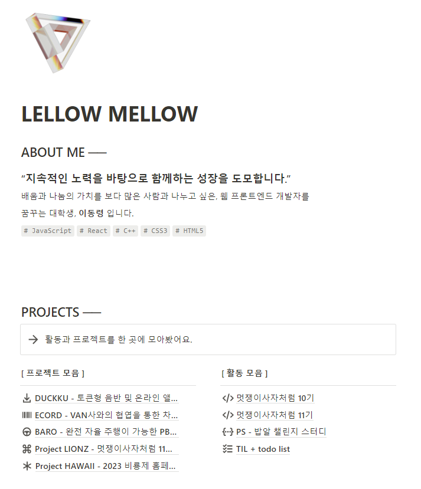
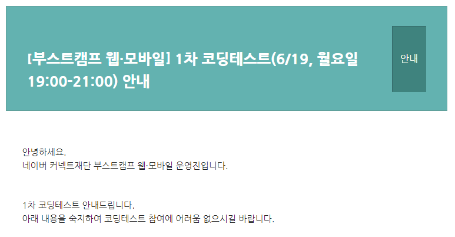
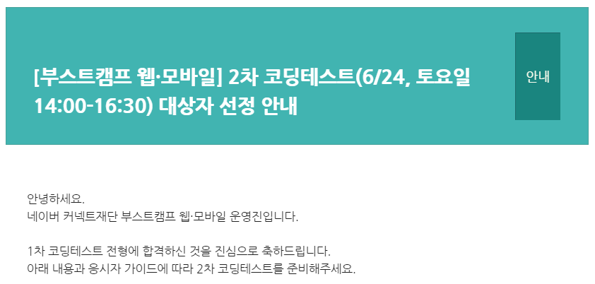
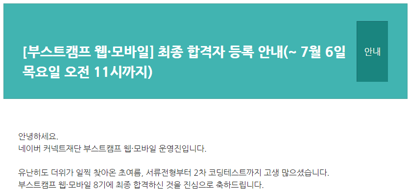
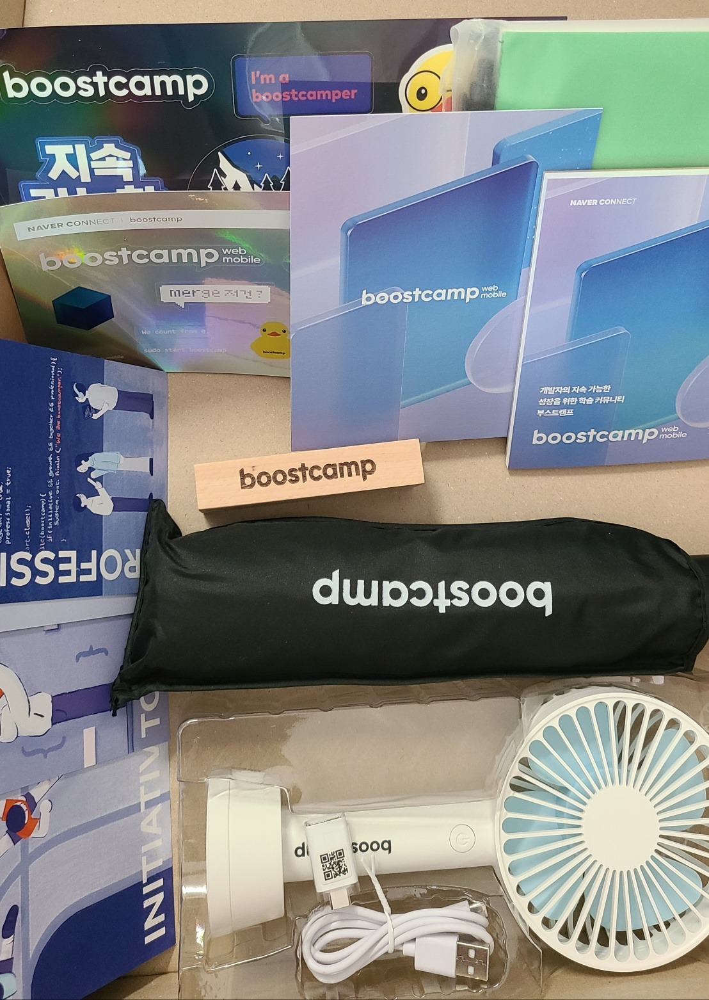

작년 하반기에 진행되었던 우테코 프리코스를 끝까지 완주하지 못했다는 아쉬움과 더불어 아직 많이 부족하다고 생각되는 개발 능력과 CS 지식 향상을 위해 올해 네이버 부스트캠프 8기에 지원하게 되었습니다.

 

주변에서 `SAFFY`, `우테코`, `소마` 와 같이 정말 많이 들어왔던 코딩 캠프이기도 하고, 새로운 도전을 해보고자 지원을 결심하였습니다. 이번 글은 지원 과정에서 7기 지원 후기를 보며 많은 도움을 받았기에 동일한 목적으로 기록을 남기고자 하는 것이 목적입니다. **혹여나 글 내용이 문제가 있는 경우, 수정 혹은 삭제를 진행할 예정입니다.**

# 부스트캠프 8기 모집 안내

### 모집 안내

- **인원** : 약 300명 내외

- **분야** : 웹 풀스택(JavaScript), 모바일 iOS(Swift), 모바일 Android(Kotlin)

### 지원 자격

- 2023년 하반기에 풀타임(월 - 금, 10:00 - 19:00)으로 참여하실 수 있는 분

- 분야에 관계없이 개발 경력 2년 미만인 분

- 만 19세 이상 성인

### 모집 일정

> 자세한 내용은 [네이버 부스트캠프 공식 네이버 블로그](https://blog.naver.com/PostView.naver?blogId=boostcamp_official&logNo=223106301465&parentCategoryNo=&categoryNo=39&viewDate=&isShowPopularPosts=false&from=postView)를 확인해보세요.

- **서류 접수** : 2023년 5월 2일 ~ 2023년 6월 12일 오전 11시

- **서류 전형 결과 안내** : 2023년 6월 14일(수) 오후 12시 30분 경

- **1차 코딩 테스트 응시료 납부 마감일** : 2023년 6월 15일(목) 자정
- **1차 코딩 테스트 안내** : 2023년 6월 16일(금) 오후 5시 경

- **1차 코딩 테스트 진행** : 2023년 6월 19일(월) 오후 7시 ~ 9시

- **1차 코딩 테스트 결과** : 2023년 6월 21일(수) 오후 5시 경

- **2차 코딩 테스트 진행** : 2023년 6월 24일(토) 오후 2시 ~ 4시 30분

- **챌린지 합격자 발표** : 2023년 7월 5일 예정 > 7월 4일 오후 8시 경에 발표

# 지원 과정

멋쟁이사자처럼 10기 동아리 활동을 부원으로 참여하고, 현재 인하대학교 멋쟁이사자처럼 11기 대표를 담당하고 있지만, 개발자가 되기 위해 필요한 CS 지식과 더불어 기초가 부족하다고 생각하고 있었습니다. 간단하고 토이 프로젝트 수준인 개인 프로젝트도 진행하였지만, 새로운 라이브러리나 프레임워크를 사용하여 개발하여 새로운 지식을 습득하는 과정이 아닌, 기존에 학습했던 내용을 활용하는 수준이기도 했습니다.

 

따라서 좀 더 새로운 도전을 하고자 네이버 부스트캠프에 지원하게 되었습니다. 무엇보다 부스트캠프는 **지속 가능한 개발자가 되기 위한 출발점 능력과 잠재력을 쌓아가는 곳**이라는 점이 매력적으로 다가왔습니다. 1회성으로 끝나는 활동이 아닌, 해당 활동을 바탕으로 **5년, 10년 후에도 꾸준히 성장중인 개발자, 혼자 성장하는 것이 아닌 같이 성장하는 개발자**를 목표로 함께 노력하고 싶어 지원하였습니다.

# 서류 지원

총 4개의 질문으로 이루어진 서류를 작성하였습니다.

 

각 문항은 **400자 내외**로 정해져있으며, 질문들은 주로 **얼마나 자기주도적으로 노력했는가**가 주된 내용입니다. 저는 멋쟁이사자처럼 10기 동아리 활동 과정에서의 경험과 더불어 진행했던 프로젝트에 대한 경험을 녹여 작성하였습니다. 나름의 팁이라면 **네이버 부스트캠프에서의 인재상**을 참고하여 작성하는 것입니다.

 

이와 관련해서는 꼭 **온라인 설명회**와 **수료생 MEET UP**에 참여하는 것을 추천드립니다. 네이버 부스트캠프를 경험한 캠퍼 선배님들의 조언과 더불어 네이버 부스트캠프와 관련된 보다 다양한 경험들을 들을 수 있었습니다.

링크와 파일을 제출할 수 있었는데, 이제까지 진행하고 참여했던 **프로젝트와 활동과 관련된 링크와 내용들을 정리한 notion 링크**를 첨부하였습니다.

이번에는 서류 지원 단계에서도 심사가 있었습니다. 다행히 합격하여 1차 코딩테스트를 준비하였습니다.

# 1차 코딩 테스트

1차 코딩 테스트는 **CS 문제**와 **코딩 테스트** 2가지로 이루어져 있습니다. 문제 비중은 아래와 같습니다. **CS 문제가 총 10문제, 코딩 테스트가 2문제로 총 12문제**로 이루어져 있습니다.

 

CS 문제는 생각보다 까다롭다고 느껴졌습니다. 모르는 개념도 있었고, 검색을 해도 쉽게 답을 알아낼 수 없던 문제들도 있었습니다. 시험 종료 버튼을 누르는 그 순간까지도 고민을 하게 만들었던...

 

코딩 테스트 문제는 난이도가 어렵기보다는 **얼마나 주어진 조건에 맞추어 구현을 잘 하는가**를 판단하기 위한 문제라고 느껴졌습니다. 두 문제 전부 테스트 케이스는 통과했으나, 모든 조건을 만족했는지는 의심이 되는 상태로 시간이 부족해 제출하게 되었습니다.

 

모든 경우를 확인해보지 못해 확실한 2솔이라 할 수 없는 상황이기도 하고, CS 문제들도 고민만 하다 제출했던 느낌이 강해 2차 코딩 테스트를 볼 수 있을까 생각도 들었지만 감사하게도 1차 코딩 테스트 합격 메일을 받았습니다.

> 이번 8기 지원 과정에서는 **코딩 테스트 유형 예시**를 공개하였습니다.
>
> - [코딩 테스트 유형 예시](https://blog.naver.com/boostcamp_official/223085597916)를 참고하시어 미리 코딩 테스트 유형을 확인해보시는 것도 많은 도움이 되리라 생각합니다.
> - 또한 CS 문제 대비를 위해 [부스트코스 CS50 강의](https://www.boostcourse.org/cs112)를 수강하였습니다. 부족한 CS 지식을 보충할 수 있는 강의라고 생각합니다.

# 2차 코딩 테스트

1차 코딩 테스트와 비슷한 방식으로 2차 코딩 테스트가 진행되었습니다. **2차 코딩 테스트는 총 6문제**로 이루어져 있으며, 그 중에 코딩 테스트 문제는 **3문제**로 이루어져 있습니다.

 

수료생 MEET UP 행사에서도 상대적으로 2차 코딩 테스트의 구현 난이도와 조건이 더 복잡하고 어렵다는 이야기에 걱정이 많았습니다. 대부분 **프로그래머스 lv 2** 정도의 난이도로 느껴지는 문제들이지만, 역시 시간이 오래 걸리는 문제였습니다.

 

이전보다 주어진 조건도 많았고, 예외 처리와 관련된 조건도 많았습니다. 1번 문제에서 최대한 코드와 주석을 깔끔하게 작성하고 틀리지 않도록 확인하기 위해 시간을 많이 사용했고, 2번 문제에서 대부분의 시간을 사용해서 3번은 문제도 읽지 못하고 테스트를 종료하였습니다.

 

조금이라도 점수를 받을 수 있지 않을까 하는 마음에 3번 문제에서는 하나의 조건이라도 만족할 수 있도록 급하게 코드를 작성하였습니다. 1번과 2번의 테스트 케이스는 통과하였지만.. 특히나 2번은 코드를 작성하고 살펴보면서 틀린 부분을 정말 많이 수정했기 때문에, 완벽한 답안이라고 할 수 없었습니다.

 

결국 애매한 1.5솔의 느낌으로 테스트를 종료하였습니다.

> 나름의 팁이라면 **꼼꼼하게 문제를 읽고 조건을 잘 정리하시는 것을 추천**드립니다. 조건과 예외 처리가 많았기 때문에 이를 잘 정리하여 이해하고 코드로 작성하는 것이 중요할 것이라 생각합니다.

# 대망의 결과...

붙었으면 좋겠다.... 근데 떨어지면 어쩔 수 없지... 라고 생각하며 탈락하면 할 일들을 생각하고 있던 중에 감사하게도 합격 메일을 받아볼 수 있었습니다.

 

앞으로 4주간의 챌린지 기간을 통해 많은 성장을 이루어낼 수 있었으면 좋겠습니다.

# 그리고 받은 온보딩 키트

이전 기수에게는 과자 타워를, 7기에서는 슬리퍼를 온보딩 키트로 받았다는 후기들을 살펴보고 이번 온보딩 키트에는 어떤 굿즈들이 들어있을까 기대가 많았습니다. 이번에는 정말 실용적인 굿즈들로 가득한 온보딩 키트가 배송되었습니다.

 

무엇보다 최근 우산이 망가져서 2단 우산을 대충 들고다니던 참인데... 정말 필요한 3단 우산... 정말 만족스러운 온보딩 키트였습니다.
