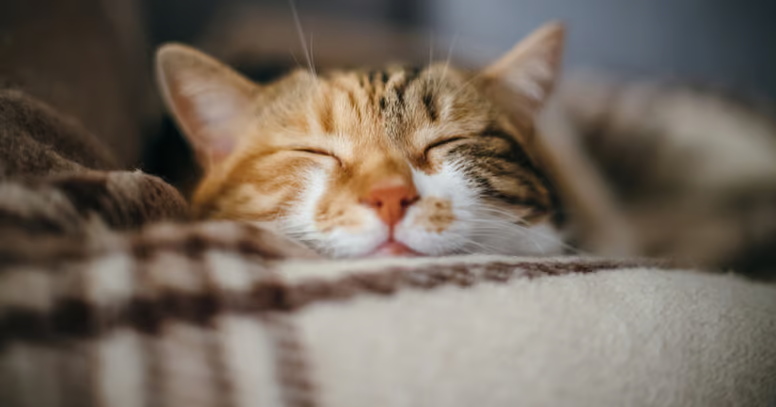
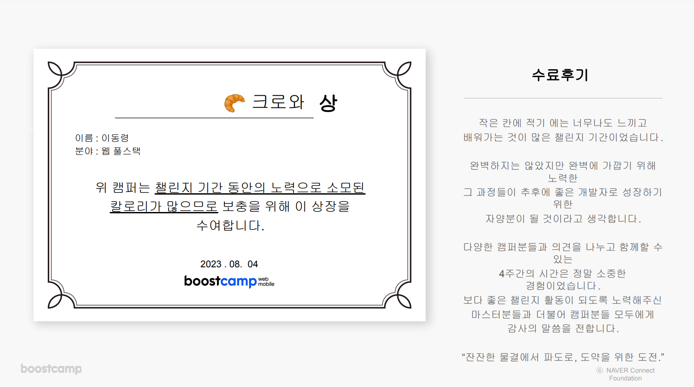

> 해당 글은 부스트캠프 웹・모바일 8기 챌린지 활동과 관련된 내용을 담고 있습니다.

 

 

> 함께 성장의 가치를 알 수 있도록 도와주신 **성인님, 영빈님, 호선님, 진혁님, 준수님, 지예님, 민규님, 영우님, 재현님, 상원님, 진성님, 민님, 현우님, 지은님, 용현님, 정민님, 현우님, 검기님**께 감사의 말씀을 전합니다.
>
> 다른 캠퍼분들에게도 감사 인사 드립니다.

# 해치웠나?

정말 많은 일들로 가득했던 4주간의 챌린지 활동이 드디어 막을 내렸습니다. 챌린지 과정에서 어떤 것을 학습했고, 어떤 부분이 성장했는지를 공유드리고자 합니다.

# 3번 죽었다 살아났습니다.

챌린지 기간동안 3번의 실패를 경험했습니다. 정말 아스팔트 바닥에 얼굴부터 넘어졌던 경험이라, 각 실패 과정에서 어떤 점들을 느꼈고 이겨낼 수 있었는지에 대해 적어볼까 합니다.

## 나는 말하는 감자

무려 1주차부터 벽을 느꼈습니다. 처음 보는 개념에 처음 보는 라이브러리에... 어디서부터 손을 대야 할지 도무지 모르겠는 상황을 마주했습니다.

 

> ❓ 이게 도대체 뭐지?
>
> ❓ 어디서부터 시작하지?
>
> ❓ 어떻게 작성하지?
>
> ❓ 어떤 개념을 공부하지?

 

고민과 생각이 꼬리에 꼬리를 물고 길어지기만 했습니다. 결국 정말 기본적인 기능만 구현을 완료한 상태로 하루를 마무리했습니다. 생각이 많아지는 하루였습니다.

 

> **'1주차부터 이렇게 힘든데 내가 4주차까지 이 과정을 버틸 수 있을까?'**
>
> **'이건 내 길이 아닌건가?'**

 

챌린지 과정을 수료한 시점에서 바라보자면 정말 의미가 없는 고민들이지만, 그 당시에는 정말 큰 고민이었습니다. 그 당시에 작성했던 회고록이 큰 도움이 되었습니다. 절망감과 자괴감 같은 감정을 배제하고 객관적으로 현 상황을 바라보며 **앞으로 이러한 일을 동일하게 마주했을 때, 어떻게 이겨낼 수 있을지**에 대한 고민을 시작했습니다.

 

이러한 고민들을 바탕으로 나만의 규칙을 정했습니다. 전부 지키지는 못했지만, 일부 규칙들은 정말 많은 도움이 되었습니다.

 

> **하루를 알차게 보내는 규칙**
>
> - 개념 혹은 과제 어느 한 쪽에 너무 집중하지 말자.
> - 과제와 관련된 개념을 간단히 1~2시간 정도 공부하자.
> - 과제는 특정 시간이 되면 잠시 내려놓자.
> - 과제도 중요하지만 개념도 중요하다. 개념 정리는 꼼꼼하게 하려고 노력해보자.
> - 특정 시간을 주기로 삼아 주기적으로 진행도를 체크해보자. 길을 찾을 수 있는 나침반이 될 것이다.
> - 정말 한 일이 없어도 새벽 2시에는 잠자리에 들자. 우리에게는 내일도 있다.
> - 잠시 다른 캠퍼들도 둘러보자. 내가 하는 고민들에 대한 답을 찾을 수도 있다.

 

> **하루를 아름답게 보내는 규칙**
>
> - 아무리 바빠도 2일에 한 번씩은 산책을 나가자. 많이도 아니고 30분만 걷자. 산책은 생각을 정리하는 훌륭한 도구다. 때로는 잡생각을 비워버릴 수 있는 기회이기도 하다.
> - 다른 사람과 비교하지 말자. 잘하는 사람들은 그 실력 뒤에 노력한 시간이 존재할 것이다.
> - 나만의 페이스와 기준을 찾자. 무조건 과제를 완벽하게 하는 것이 중요하지는 않다. 내 기준과 속도에 맞추어 차근차근 계단을 올라가는 것이 중요하다.
> - 완벽함을 추구하는 것은 매우 위험하다. 완벽이라는 단어에 홀려 정작 중요한 일들을 신경쓰지 않았던 예전을 생각해보자.

 

해당 규칙과 관련하여 고민한 과정은 [1주차 회고록](https://velog.io/@pexe99/2023-%EB%B6%80%EC%8A%A4%ED%8A%B8%EC%BA%A0%ED%94%84-Web-Mobile-8%EA%B8%B0-1%EC%A3%BC%EC%B0%A8-%ED%9A%8C%EA%B3%A0)에서 확인하실 수 있습니다.

## 나는 왜 저렇게 못하지?

사실 첫 번째 실패를 이겨내는 과정에서 생각해보지 못한 부분이 있었습니다. 바로 **내가 실패를 마주하게 된 원인이 무엇인가?** 였습니다. 이를 두 번째 실패 과정에서 새로 깨닫게 되었습니다.

 

> 다른 캠퍼들과 나를 비교하지 말자.

 

상대방과의 비교는 좋은 동기부여가 될 수도 있지만 때로는 독이 될 수도 있습니다. 사실 상대방과 나 자신을 비교하는 것은 하지 말자고 생각해도 무의식중에 수없이 반복하고 있습니다. 당장 길거리로 나가 지나가는 사람들을 보는 것만으로도 이미 알게 모르게 비교를 하고 있을 것이라 생각합니다. (이 부분은 어디까지나 개인적인 생각입니다.)

 

그렇기에 의식적으로 타인과의 비교가 아닌 **나 자신과의 비교**를 지속적으로 진행하는 것이 중요하다고 생각합니다.

 

> **어제의 나와 오늘의 나를 비교하자**
>
> - 타인과의 과도한 비교는 스스로에게 독이 될 수 있다.
> - 어제의 나와 오늘의 나에 대한 비교를 통해 스스로의 성장 과정을 객관화하자.
> - 스스로에 대한 객관성을 길러 메타인지를 활성화하자.

 

단순히 비교를 통한 감정 소모가 아닌 보다 발전한 스스로를 발견할 수 있도록, 그리고 이러한 과정이 동기 부여로 작용하여 더 멀리 달려나갈 수 있는 힘이 될 수 있도록 하였습니다.

## 힘들다, 그래도 달려보자

사실상 세 번째 실패와 관련된 이야기가 4주차 회고입니다. 4주차는 챌린지 마지막 주였기 때문에 더더욱 아쉬움이 많이 남는 한 주였습니다. 그리고 마지막 주차답게 또 한 번의 실패를 경험했습니다. 스스로 생각해본 이번 실패의 이유는 다음과 같습니다.

### 체력, 집중력의 저하. 피로 누적

주말에 분명 휴식을 취했다고 생각했음에도 불구하고, 4주가량 계속 진행해온 챌린지 활동으로 모르는 사이에 피로가 누적되고 있었습니다. 일 단위로 꾸준히 작성했던 회고록과 더불어 챌린지 활동 진행에 있어 꼼꼼함을 잃어버렸다고 생각합니다. 누적된 피로와 더불어 하루 루틴을 유지하지 못해 이로 인한 체력 저하와 더불어 집중력 저하도 크다고 생각합니다.

### 개념의 부족

이전에 실패를 경험했던 과제와 동일하게 상대적으로 이해가 부족한 개념이 바탕이 되는 과제였습니다. 이전에 개념을 이해하지 못해 개념에만 집중하여 정작 구현은 전혀 진행하지 못했던 경험이 있었기에 구현에만 너무 많은 시간을 소비하였습니다. 어느정도 이해하고 있는 개념과 관련된 과제에서는 이러한 자원 분배가 유연하게 잘 이루어졌는데 비해, 구현과 개념 중 한 방향으로 기울어지는 과제의 경우에는 이러한 기준이 아직 명확하지 않을 뿐더러 어떠한 시퀀스를 가지고 과제를 진행해야 하는지에 대한 고민이 많이 부족했습니다.

 

집중력과 체력의 부족도 물론 영향이 있었지만, 무엇보다 **가지고 있는 기준을 유연하게 적용하지 못했던 것**이 가장 큰 이유라고 생각합니다.

 

> **사실 기준은 크게 다른 점이 없습니다.**
>
> **→ 구현과 개념 정리, 어느 한 곳으로 기울지 않도록 예의 주시하는 것.**

 

다만, 이러한 기준을 상황에 따라 어떻게 달리 적용하는지가 관건이 되겠습니다. 기준은 명확하되, 이를 얼마나 유동적으로 접근하고 적용할 수 있는지, 이에 대한 해결책을 고민해보는 것이 챌린지 이후의 스스로 던져주는 퀘스트라고 생각합니다.

# 실패로 얻어낸 값진 성장

 

챌린지 과정은 매일이 새로운 도전이였습니다. 매번 생소한 개념을 바탕으로 진행하는 과제는 어렵게만 느껴지고, 이 과정에서 많은 고통을 느꼈습니다. 하지만 이제는 **이러한 과정을 즐길 수 있게 되었다**고 감히 말씀드릴 수 있을 것 같습니다. 사실 새로운 도전은 개념에 대한 도전보다는 **스스로의 한계에 대한 도전**이라고 할 수 있겠습니다.

 

또한 이러한 경험을 통해 **실패를 두려워하지 않는 나**로 성장할 수 있었습니다. 어떤 일을 시작할 때 항상 마음 한 켠에 가지고 있는 생각이 있었습니다.

 

> **막상 시작했는데 너무 어려워서 포기하면 어떻게 하지? 이걸 내가 할 수 있을까?**

 

아직 일어나지도 않은 실패에 대한 막연한 두려움이 크게 작용했다고 생각합니다. 이러한 생각을 항상 가지고 있었기에 무언가를 새롭게 도전하는 것이 항상 두려웠고, 쉽사리 도전해보지도 못했습니다.

 

> **안전하게 넘어지는 방법을 배웠습니다.**

실패를 두려워하지 않아야합니다. 사실 너무 당연한 이야기라 식상하긴 하지만, 두려워하지 않고 실패를 경험해보는 것이 정말 중요하다고 생각합니다. 계속 넘어지는 것을 반복하며 오히려 실패의 과정에서 성장하는 스스로를 발견하는 새로운 기회로 다가왔습니다. 또한 한 번 넘어져봤으니, 다음에는 더 안전하게 넘어지고 더 쉽게 일어날 수 있는 나만의 노하우가 생길 것이라 생각합니다.

# 나만의 챌린지

아직 챌린지는 끝나지 않았습니다. 챌린지에서 얻을 수 있었던 값진 경험을 바탕으로 지속적인 성장을 위한 나만의 작은 챌린지를 진행할까 합니다. 앞으로는 꾸준히 **주간, 월간, 연간 회고를 진행**할 예정입니다.

 

회고는 인생에 있어 중요한 행동이라고 생각합니다. 내가 특정 기간동안 어떤 것을 목표로 두고 얼마나 노력했는지, 그 과정에서 어떤 것을 느꼈고 얼마나 개선할 수 있을지를 객관적으로 바라보며 과거를 되돌아볼 수 있습니다. 과거를 되돌아본 시간을 바탕으로 새로운 미래를 그려나갈 수도 있는 좋은 활동이라고 생각합니다.

 

여기서 주간 회고가 나만의 애자일 스프린트라고 생각합니다. 짧은 기간에 대한 계획을 수립한 이후, 어떤 것을 느꼈는지 기록하며 **어제의 나보다 한 걸음 앞선 오늘의 나**를 만들기 위해 노력합니다.

 

부족한 회고록을 읽어주셔서 감사드립니다.
