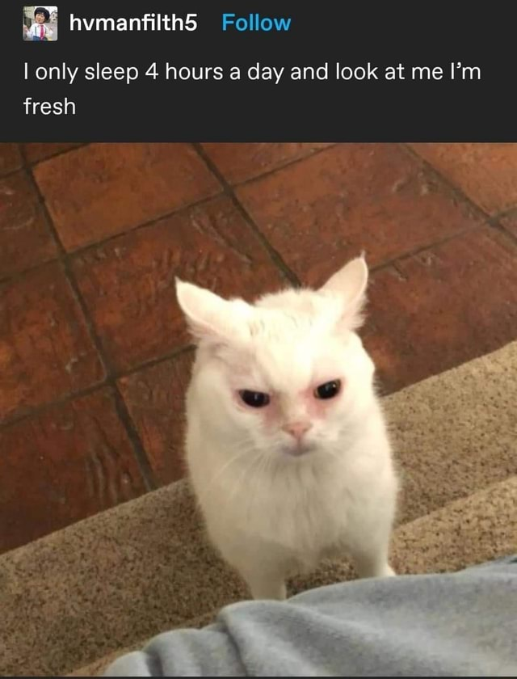

> 해당 글은 부스트캠프 웹・모바일 8기 챌린지 활동과 관련된 내용을 담고 있습니다.

# 회고록 작성을 시작하며...

정말 눈코 뜰 새 없이 바쁜 일주일이 지나갔습니다. 한 주를 마무리하는 7월 16일 일요일, 부스트캠프 8기 챌린지 캠퍼로써 5일간의 챌린지 기간동안 느낀점을 기록합니다.

# 행복할 줄 알았던 일주일

정말 붙으리라고는 생각하지 못했던 부스트캠프 8기 챌린지에 합격하여 캠퍼로 활동할 수 있는 기회가 주어졌습니다. OT와 더불어 1일차 활동을 시작하기 전까지는 설레였던 감정이 더 컸습니다. 주변에서 ‘부스트캠프 많이 힘들다더라’ 라는 이야기도 많이 들었지만, ‘에이 그래도 힘들면 얼마나 힘들겠어’ 라는 생각으로 활동을 시작했습니다.

 

> 역시 사람은 입을 조심해야 합니다. ‘힘들면 얼마나 힘들겠어’? 정말 많이 힘들었습니다.

 

자세한 일정까지는 공개할 수 없을 것 같아, 매일 주어지는 과제의 난이도와 공부량을 생각한다면… 정말 상상 그 이상이였습니다. 매일 새로운 개념에 매일 새로운 코드, 매일 새로운 과제가 쏟아졌습니다.

 

CS지식을 주로 학습하는 챌린지 기간이기에 난이도가 있으리라고는 생각했지만 정말 어렵다고 느껴졌습니다. 이제까지 눈앞에 주어진 과제만 간간이 처리하던 저에게는 정말 놀라우리만큼 많고 어렵게 느껴졌습니다. 이번 글에서는 짧지만 그 험난한 과정에서 느끼고 새로 배운 점들을 공유해볼까 합니다.

## 시간 분배

정말 절실히 시간 분배의 기준이 필요했습니다. 새로운 개념을 먼저 정리하자니 과제를 수행할 시간이 부족했고, 개념을 잠시 내려두고 과제를 수행하자니 개념이 부족해 과제를 수행할 수 없었습니다. 이 둘을 모두 챙겨가기에는 시간적인 여유가 존재하지 않습니다.

 

초반 과제들은 개념은 간단히 검색을 통해 읽고 과제를 수행하였습니다. 사실 이런 방식으로 어느정도 해결할 수 있는 과제들이기에 가능했다고 생각합니다. 하지만 후반 과제는 그렇지 않았습니다. 컴퓨터공학과 강의에서 분명 배운 내용임에도 정말 애매하게 기억에 남아있기 때문에 다시 공부할 필요도 있었지만, 과제의 볼륨도 크다고 생각했기에 어느 것을 먼저 처리해야할지 고민이 컸습니다.

 

이러지도 저러지도 못한 끝에 그 무엇도 해낸 것이 없는 하루를 보냈을때는 자괴감과 후회로 가득차곤 했습니다. 하지만 후회만 하고 있을 시간이 없습니다. 어서 빨리 움직여야겠다고 생각했습니다.

 

일주일을 돌이켜보며 다음과 같은 규칙을 스스로 만들어보았습니다. 이 규칙이 정답이라고 할 수는 없으므로 남은 챌린지 기간을 통해 보완할 예정입니다.

 

> **하루를 알차게 보내는 규칙**
>
> - 개념 혹은 과제 어느 한 쪽에 너무 집중하지 말자.
> - 과제와 관련된 개념을 간단히 1~2시간 정도 공부하자.
> - 과제는 특정 시간이 되면 잠시 내려놓자.
> - 과제도 중요하지만 개념도 중요하다. 개념 정리는 꼼꼼하게 하려고 노력해보자.
> - 특정 시간을 주기로 삼아 주기적으로 진행도를 체크해보자. 길을 찾을 수 있는 나침반이 될 것이다.
> - 정말 한 일이 없어도 새벽 2시에는 잠자리에 들자. 우리에게는 내일도 있다.
> - 잠시 다른 캠퍼들도 둘러보자. 내가 하는 고민들에 대한 답을 찾을 수도 있다.

## 멘탈과 건강 관리

하루 12시간을 넘게 책상 앞에 앉아있다보니 스스로 몸이 망가져감을 느꼈습니다. 몸과 목이 점점 앞으로 굽어지면서 목도 아프고… 체력도 떨어져감을 느꼈습니다.

 

사실 나빠지기 시작한건 몸만은 아니였습니다. 무의식중에 잘하는 다른 캠퍼분들과 스스로를 비교하기 시작했습니다. ‘저 사람은 저렇게 잘하는데 나는 늦게라도 해서 간극을 채워야지’ 라는 생각으로 무리하기도 했습니다.

 

결국 무리하며 얻은 결과가 좋았냐, 고 되묻는다면 그렇지는 않았습니다. 어떻게든 빠르게 작업해서 제출해야지, 빠르게 개념을 학습해야지에 매몰되어 정작 중요한 것은 안중에도 없는 상황이 벌어졌습니다.

 

그래서 보다 건강한 2주차를 위한 나름의 규칙을 만들어보았습니다. 이 역시 남은 챌린지 기간을 통해 보완할 예정입니다.

 

> **하루를 아름답게 보내는 규칙**
>
> - 아무리 바빠도 2일에 한 번씩은 산책을 나가자. 많이도 아니고 30분만 걷자. 산책은 생각을 정리하는 훌륭한 도구다. 때로는 잡생각을 비워버릴 수 있는 기회이기도 하다.
> - 다른 사람과 비교하지 말자. 잘하는 사람들은 그 실력 뒤에 노력한 시간이 존재할 것이다.
> - 나만의 페이스와 기준을 찾자. 무조건 과제를 완벽하게 하는 것이 중요하지는 않다. 내 기준과 속도에 맞추어 차근차근 계단을 올라가는 것이 중요하다.
> - 완벽함을 추구하는 것은 매우 위험하다. 완벽이라는 단어에 홀려 정작 중요한 일들을 신경쓰지 않았던 예전을 생각해보자.

# 회고록을 마치며...

짧은 시간임에도 불구하고 정말 느끼고 배운 것이 많은 활동이라는 생각이 들었습니다. 성급해하지 않고, 어제의 나와 오늘의 나를 생각하며 계단을 뛰어넘는 토끼보다는 차분히 천천히 하나씩 올라가는 거북이가 되기 위한 노력이 필요한 시점이라고 생각합니다.

 

부족한 글을 읽어주셔서 감사드립니다. 똑같은 고민을 하는 누군가에게라도 이 글이 도움이 되었으면 합니다.
