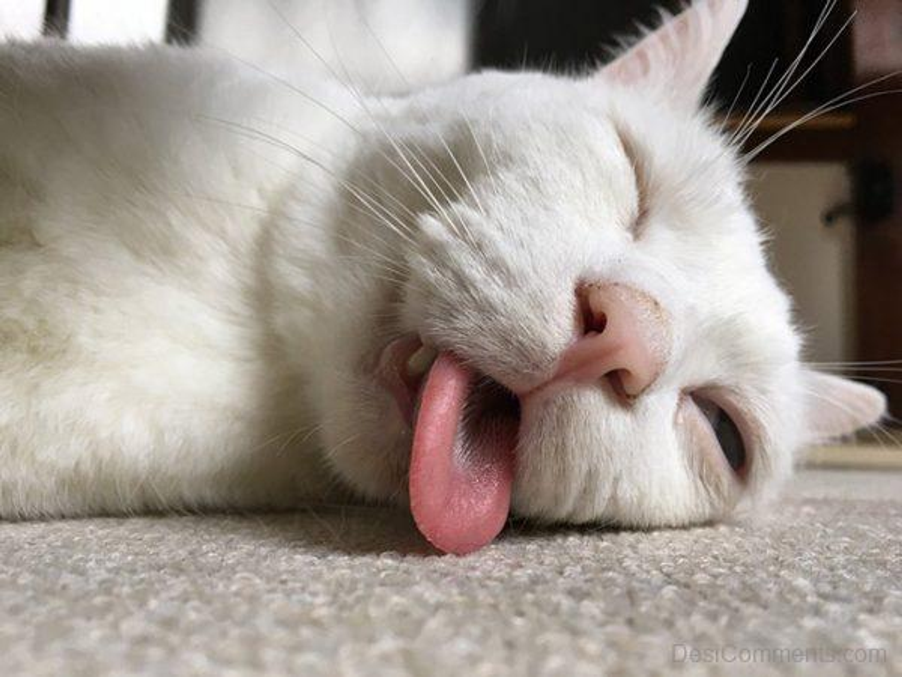

> 해당 글은 부스트캠프 웹・모바일 8기 챌린지 활동과 관련된 내용을 담고 있습니다.

# 회고록 작성을 시작하며...

또 다른 일주일이 지났습니다. 짧은 기간이지만 많은 생각과 고민을 이어나가게 되는 일주일이었습니다. 저번 주와 동일하게 회고록을 작성하며 한 주를 마무리합니다.

# 그래도 2주차인데, 좀 익숙해지지 않았어?

과연 익숙해졌을까요? 이번 일주일을 되돌아본다면 분명히 익숙해진 부분도 존재하겠지만, 아니라고 생각하는 부분이 더 컸습니다. 첫 일주일에 비해서는 과정 자체는 익숙해졌으나, 그 과정을 헤쳐 나가는 것은 쉽지만은 않았습니다.

 

이번 주차에는 어떤 것을 달성했고, 느꼈고, 학습했는지와 아쉬운 부분에 대해 이야기를 풀어볼까 합니다.

## 1주차의 규칙, 잘 지켜졌을까?

1주차 회고를 진행하여 더 의미있고 효율적인 챌린지 활동이 되고자 몇 가지 규칙을 만들었습니다. 이를 2주차에 스스로 잘 적용했을까요? 1주차 회고록이 궁금하시다면 [여기](https://velog.io/@pexe99/2023-부스트캠프-Web-Mobile-8기-1주차-회고)를 참고해주세요.

 

> **하루를 알차게 보내는 규칙**
>
> - ⭕ 개념 혹은 과제 어느 한 쪽에 너무 집중하지 말자.
> - ⭕ 과제와 관련된 개념을 간단히 1~2시간 정도 공부하자.
> - ⭕ 과제는 특정 시간이 되면 잠시 내려놓자.
> - ❌ 과제도 중요하지만 개념도 중요하다. 개념 정리는 꼼꼼하게 하려고 노력해보자.
> - ⭕ 특정 시간을 주기로 삼아 주기적으로 진행도를 체크해보자. 길을 찾을 수 있는 나침반이 될 것이다.
> - ⭕ 정말 한 일이 없어도 새벽 2시에는 잠자리에 들자. 우리에게는 내일도 있다.
> - ⭕ 잠시 다른 캠퍼들도 둘러보자. 내가 하는 고민들에 대한 답을 찾을 수도 있다.

 

개념(학습)과 과제(구현) 사이의 균형을 잡는 것이 2주차의 주된 목표였습니다. 과제의 내용을 파악하고 개념으로 연관지을 수 있는 키워드를 정리하였습니다. 이후, 이를 바탕으로 키워드와 관련된 개념에 대해 학습하는 것에 초점을 두었습니다.

 

짧은 시간 내에 지식을 **나만의 언어로 작성**하는 것은 쉽지 않다고 생각하였습니다. 대신, 이를 다른 사람이 읽고 이해할 수 있을 수준으로의 정리는 가능했습니다. 키워드를 중심으로 개념을 설명하며, **이 개념이 왜 중요한지, 다른 개념과는 어떻게 연관되는지**를 중심으로 정리하기 위한 연습 과정이었습니다.

 

다만, 짧은 시간이었고 개념과 관련하여 깊은 부분까지 학습하기에는 학습 정리 과정이 미흡했습니다. 이와 관련하여 3주차에는 개선하고 구조화하는 것에 대한 노력이 필요할 것 같습니다.

## 멘탈과 건강의 현 주소

1주차에 비해서는 중심을 잡을 수 있었습니다. 특히나 주중에 진행되었던 커뮤니티 이벤트에서 나누었던 이야기들이 많은 도움이 되었습니다.

 

> 다른 캠퍼들과 나를 비교하지 말자.

 

1주차에 **하루를 아름답게 보내는 규칙**에 포함되었던 내용입니다. 나 스스로와 타인을 객관적으로 바라보는 것은 동기부여에 긍정적인 영향을 미치지만, 이에 매몰된다면 오히려 스스로를 갉아먹는 안좋은 습관이 될 수 있습니다. 실제로 1주차에서 이러한 비교를 무의식중에 반복하며 자신감과 자존감이 많이 떨어지기도 했습니다.

 

타인과의 비교를 줄이고 스스로의 발전과 성장에 집중하는 것이 중요하지만, 동기부여를 위한 새로운 습관이 필요하다는 생각이 들었습니다. 이를 바탕으로 3주차에 새롭게 시작할 하나의 루틴은 아래와 같습니다.

 

> **어제의 나와 오늘의 나를 비교하자**
>
> - 타인과의 과도한 비교는 스스로에게 독이 될 수 있다.
> - 어제의 나와 오늘의 나에 대한 비교를 통해 스스로의 성장 과정을 객관화하자.
> - 스스로에 대한 객관성을 길러 메타인지를 활성화하자.

 

이를 위한 바탕은 바로 **일별 회고**가 되겠습니다. 2주차부터 의식적으로 회고록을 작성하고 있었지만, 단순히 오늘 어떤 내용을 학습했는지, 어떤 것들을 느꼈는지에 대한 내용이 위주였습니다. 물론 이러한 회고도 충분한 도움이 되었지만 회고 방식을 변경해볼까 합니다.

## 새로운 회고 | 3L 회고법

회고록을 작성하면서 하루에 내가 어떤 학습을 진행했는지, 아쉬운 점은 무엇이였는지에 대한 하루 단위 자가 피드백을 진행할 수 있었습니다. 이전까지는 커다란 일을 하나의 단위로 하여 크게 회고록을 작성했다면, 이번에는 가볍게 짧은 기간으로 끊어 회고하는 연습을 했다고 생각합니다.

 

이러한 일 단위 회고가 이후에 주 단위, 더 나아가 월 단위와 연 단위의 회고에도 충분한 도움이 될 것 같습니다. 가령 ‘대회 나갔던 내용을 회고해야지’ 라는 생각으로 회고를 진행하려고 할 때, 분명 누구나 ‘근데 내가 뭘 했었지?’ 라는 생각을 시작으로 회고록 작성에 어려움을 겪었던 적이 있을 것이라 생각합니다. 저 또한 그러한 경험을 자주 했었고, 이번 일 단위 회고가 ‘꾸준한 기록’을 바탕으로 큰 단위의 회고를 진행하는데 있어 큰 도움이 될 것이라 생각합니다.

 

다만, 스스로를 객관화하기에는 부족한 방식이라 생각합니다. 이를 위해 3주차에는 `3L 회고법`을 도입하여 루틴화를 해볼 예정입니다. 3L 회고법은 아래와 같습니다.

 

> **3L 회고법**
>
> - 3L은 각각 아래를 의미합니다.
>
>   - `Liked` : 만족스러웠던 점
>   - `Learned` : 배웠던 점
>   - `Lacked` : 부족하거나 아쉬웠던 점
>
> - 위와 같이 크게 3가지 영역으로 나누어 회고를 진행합니다. 3L 회고법에 대한 내용은 [여기](https://velog.io/@alstnsrl98/%EC%95%A0%EC%9E%90%EC%9D%BC%EA%B3%BC-%EC%8A%A4%ED%94%84%EB%A6%B0%ED%8A%B8-%EA%B7%B8%EB%A6%AC%EA%B3%A0-%ED%9A%8C%EA%B3%A0)를 참고하였습니다.

# 회고록을 마치며...

회고 이외에도 3주차에는 성장을 위해 추가적인 노력들이 필요하다고 생각합니다. 나만의 학습 정리 방식을 찾아 이를 구조화하여 보다 빠르게 개념들을 정리하고 체화하는 연습은 물론, 건강을 위한 소소한 루틴을 자리잡기 위한 연습도 필요할 것입니다.

 

부족한 글을 읽어주셔서 감사드립니다. 3주차에는 2주차보다 아쉬움의 무게가 가벼워질 수 있도록 노력해보겠습니다.
