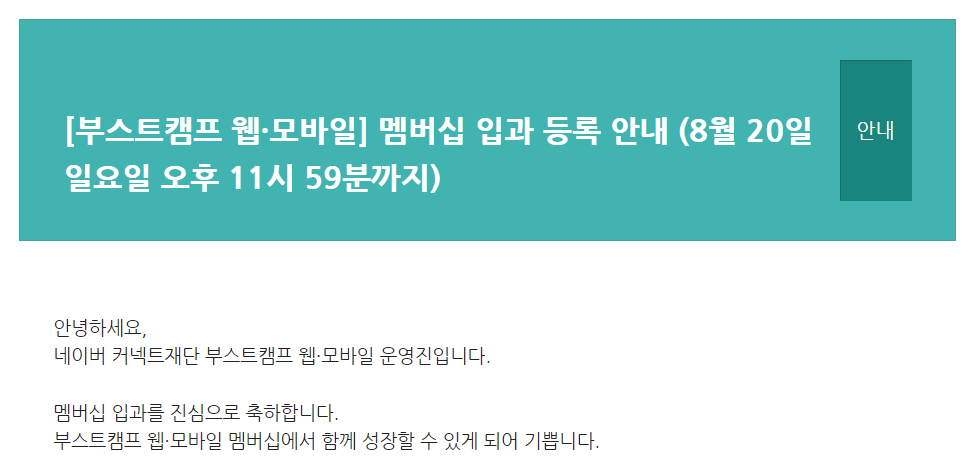

> 해당 글은 부스트캠프 웹・모바일 8기 멤버십 활동과 관련된 내용을 담고 있습니다.

# 늦은 회고, 하지만 중요하기에

멤버십을 합격한 시점으로부터 5주라는 시간이 흘렀습니다. 중간에 틈이 날 때마다 '회고록을 작성해야지'라는 생각이 들면서도 막상 회고를 어떻게 작성해야 할지, 스스로 작성하는 회고가 맞는 방향인지에 대한 의구심과 더불어 '학습도 부족한데 무슨 회고록이야'는 생각에 회고가 많이 늦어졌습니다.

 

4주간의 학습 스프린트 기간 동안 많은 성장을 이루어 내지는 못했지만 성장할 수 있는 기회를 엿볼 수 있어 이에 대해 정리하고 공유해 드리고자 회고록을 작성하게 되었습니다.

# 내가? 멤버십에? 합격?

 

처음 합격 소식을 듣고 정말 놀랐습니다. 챌린지 기간 동안 스스로 많이 부족함을 느꼈고, 합격은 힘들 것이라 생각하고 마음 편히 쉬며 시간을 보내고 있었습니다. 사실 편하게 휴식을 취하려고 했다고 하더라도 막상 합격 발표 당일이 오면 설레는 마음을 감출 수는 없었습니다.

 

결과는 정말 놀랍게도 합격. 기쁨도 잠시 걱정이 앞섰습니다. 챌린지 과정에서도 많이 부족했던 제가 멤버십 과정을 따갈 수 있을까와 더불어 1주 차부터 OT에 참석하지 못하고 예비군 훈련에 참여해야 했기 때문에 걱정이 이만저만이 아니었습니다.

 

그렇게 시간이 흘러 예비군 훈련을 마친 다음 날인 금요일, 첫 멤버십 활동에 들어가게 됩니다.

# 4주간의 경험, 새로운 문제들

챌린지 활동은 짧은 기간 동안 다양한 주제를 다루었기에 내가 작성했던 코드를 다시 살펴보고 개선할 수 있는 기회가 거의 없었습니다. 멤버십 활동은 챌린지와는 달리 이러한 개선 과정도 경험할 수 있었기에 기대감이 컸습니다. 그렇다면 4주간의 활동에서 코드 개선도 하고, 많은 경험을 해봤냐 고 스스로 질문해 볼 수 있겠습니다.

 

> 답은 '아니오' 입니다.

### 생각보다 부족한 시간, 테스크 분배 미흡

4주 내내 마음만 앞서 '어떻게든 주어진 조건들을 충족할 수 있도록 구현'하는 것에만 초점을 두었습니다. 당연히 마음만 앞섰기에 관련된 개념들도 겉으로만 간단하게 학습하고 넘어갔을 뿐더러, 사실상 '만족스럽게 구현했다'고 자신 있게 대답할 수 있는 기능도 없습니다.

 

쉬어가는 주간에 4주간의 활동을 곰곰이 돌아보며 생각해 본 오점은 크게 2가지입니다. 첫 번째는 **'너무 마음만 앞섰다'**는 것입니다. 사실 늦게 시작한 만큼 당연히 늦어질 수밖에 없고, 이를 스스로 인지하고 나에게 맞는 속도를 찾아 작업을 진행해야 했습니다. 다만, 막상 스크럼 과정에서 다른 동료들의 구현 정도와 학습의 깊이를 스스로와 비교했을 때, 너무 극명하게 차이가 벌어졌기에 이와 같은 성급함이 생겼다고 생각합니다.

 

두 번째는 내가 해야 할 **테스크를 정확하게 분배하지 못했다**는 점입니다. 적어도 일주일 단위로 어떠한 기능을 언제 구현해 볼 것인지, 어떠한 학습을 진행할 것인지에 대한 계획을 확실히 잡고 계획을 바탕으로 작업을 진행해야 했었습니다. 테스크를 정확히 분배하지 않았기에 무작정 'DB 테이블 구성하기'와 같은 모호한 테스크를 하루 안에 진행하겠다고 마음을 먹고 진행했고, 이로 인한 좋지 않은 결과가 이러한 악순환을 불러왔다고 생각합니다.

### 코드에 의미를 담아라

코드를 작성함에 있어서도 큰 문제가 있었습니다. 혹 어떤 코드를 작성했을 때, 누군가 '왜 그렇게 작성했나요'라고 질문한다면 이에 대해 명확하게 설명할 수 있으신가요? 4주간의 제가 작성한 코드를 돌아본다면 너무나 확실하게 '아니요'라고 대답할 것 같습니다.

 

사실 코드에 의미를 담는다는 것은 다르게 해석한다면 **'내가 그 코드를 정확히 이해하고 있다'**는 의미일 수도 있겠습니다. 왜 이러한 코드를 작성했는지를 설명할 수 있다는 것은 코드의 문법을 떠나서 어떻게 동작하는지까지 이해하고 있다는 의미도 된다고 생각합니다. 다만 여기서 한 가지 더 고려할 점이 있겠습니다.

### 한 번에 완벽한 코드를 작성할 수 있을까?

작업 진행 속도가 더뎠던 가장 큰 이유 중 하나였습니다. 이후에 코드를 수정할 기회가 많이 없다고 생각해 시행착오 과정을 건너뛴 코드를 작성하기 위해 노력하였습니다. 사실 결과는 너무나 뻔했습니다. 한 번에 그런 코드를 작성할 수 있을리도 없었고, 이로 인해 정작 깊게 학습해 보고자 하는 개념은 등한시하는 결과를 낳았습니다.

 

코드를 작성하는 과정에서 막연한 두려움이 있었습니다. '이렇게 작성하면 좋지 않은 코드일 것 같은데', '이렇게 구조를 가져가는 방식이 맞을까'와 같은 '코드 개선' 단계에서 고려해도 늦지 않은 부분에 대한 고민을 하고는 했습니다. 그렇기에 코드를 이해하는 것도 중요하지만, **무언가 부족하다고 해서 코드를 작성하는 것을 두려워하지는 않아야겠다**는 다짐을 하게 되었습니다.

# 짧은 회고를 마치며

상대적으로 많은 학습과 성장을 이루어 내지는 못했지만 이러한 경험과 고민, 생각들이 앞으로 나아갈 수 있는 발판이 될 수 있다고 생각합니다. 오늘의 회고가 앞으로 개발 능력 성장에 있어 **'퀀텀 점프'**가 될 수 있기를 바랍니다.
