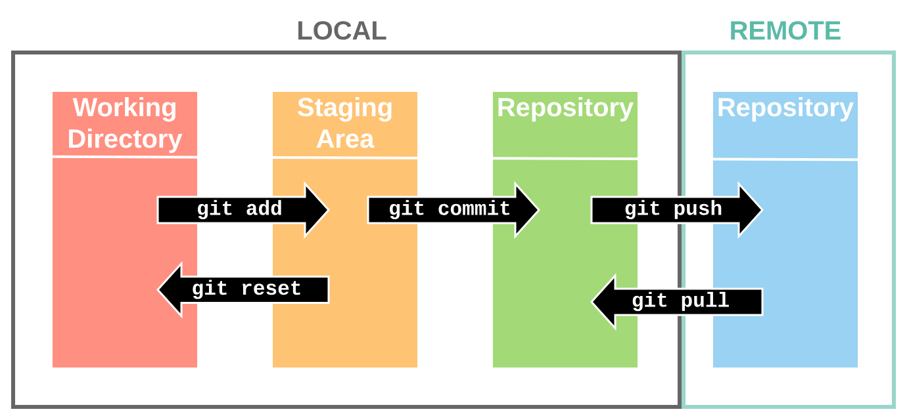
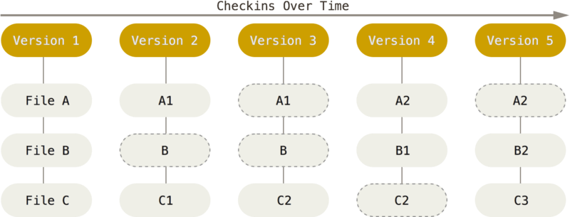
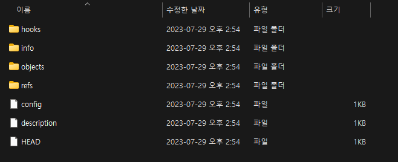
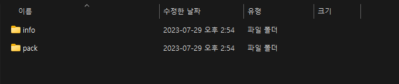
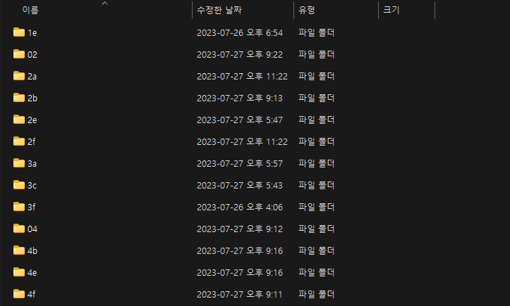
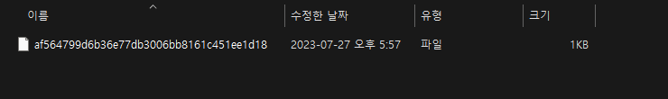

# 너무나도 당연하게 사용하는 git

> 개발자라면 git은 당연하게 쓰지 않아?

<br/>

개발 공부를 하기 위해 가장 기초적인 파트 중 하나인 `git`, 여러분은 얼마나 알고 계신가요? 단순히 `add`, `commit`, `push` 등의 명령어를 통해 상태가 변화하더라! 저는 여기까지만 알고 있었습니다. 2005년 6월에 리누스 토발즈에 의해 공개된 git이 이제는 개발자라면 당연히 사용할 수 있어야 하는 버전 관리 시스템이 된 지금, 우리는 git에 대해 얼마나 알고 사용하고 있나요?



혹 단순히 이 정도로만 알고 계시지는 않았나요? git 내부는 어떻게 동작하는가에 대해 함께 알아봅시다.

## git과 스냅샷

다른 버전 관리 시스템과 git의 가장 큰 차이점은 **차이와 스냅샷**입니다. 이전의 시스템들은 각 파일의 변화를 시간순으로 관리하였습니다. 아래 이미지를 살펴봅시다.


각 파일의 변경점에 대해 버전 단위로 이를 관리하는 모습을 볼 수 있습니다. 이를 **델타 기반 버전 관리 시스템** 이라고 합니다. 맞습니다! 수학에서의 `Δ`와 비슷한 의미라 할 수 있겠습니다. **변화량, 다른 말로 차이**가 될 수 있겠습니다.

<br/>

하지만 git은 파일들의 차이, 변화보다는 **스냅샷**에 집중했습니다. 파일이 달라지지 않았으면 git은 성능을 위해 새로 저장하지 않고, 이전 상태의 파일 링크를 저장하는 방식으로 구성하였습니다.



기존의 델타 방식은 파일에 변화가 생겼을 때 "변화된 사항"만 기록했다면, git은 변화가 생기면 이를 통째로 기록한다는 것에서 차이가 있습니다. 근데 이게 효율적인가요? 이렇게 생각해봅시다.

<br/>

> **Q. 어떤 한 파일이 1000번 수정된 상태입니다.
> 여기서 512번째 상태의 파일을 확인해보고 싶습니다.**
>
> - 델타 방식은 처음부터 변화를 탐색하여 512번째까지 진행해야 해당 상태의 파일을 확인할 수 있습니다.
> - 스냅샷 방식은 그냥 512번째 파일을 확인하면 그만입니다.

<br/>

바로 이러한 부분에서 git이 버전 관리에 더 용이하다고 할 수 있습니다.

## git 파일 상태

> **git이 하는 일**
>
> 1. working tree에서 파일을 수정
> 2. Staging Area에 파일을 stage하여 commit할 스냅샷을 생성
> 3. Staging Area에 있는 파일들을 commit하여 영구적인 스냅샷으로 저장

<br/>

여기서 working tree는 우리가 작업하는 폴더라고 쉽게 생각할 수 있습니다. 쉽게 말해 **수정한 파일들에 대한 스냅샷을 남기기 위해 staging area에 모아 이를 하나의 스냅샷으로 저장한다**라고 이해합시다. 이를 바로 **Git directory**에 저장하게 됩니다. 즉, **git directory**는 프로젝트의 데이터를 저장하는 곳이자 핵심이라고 할 수 있겠습니다.


위와 같이 `git add`를 이용해 Staged 상태로 변경하고, 이를 모아 `git commit`을 통해 버전 관리를 진행하게 됩니다. 여기서 git은 파일을 상태를 가지고 구분하여 작업합니다. 각 과정에서 어떻게 동작하는지를 파악하기 이전에 가볍게 확인하고 넘어가겠습니다.


> **git 파일의 상태**
>
> - `untracked` : 아직 git의 관리 대상이 아닌 파일을 의미
> - `unmodified` : 아무런 수정 사항이 없는 파일
> - `modified` : 수정된 파일
> - `staged` : commit되기 이전 상태

여기서 `staged`는 `staging area`에 있는 파일을 의미합니다. 이러한 사이클을 바탕으로 파일의 상태를 변경하게 됩니다.

## Git 개체

git은 `.git` directory 내부에 스냅샷과 더불어 버전 관리를 위한 다양한 정보를 저장합니다. 내부적으로 object 단위로 관리하며 여기에는 `commit`, `tree`,`blob`, `tag` 총 4가지 타입이 존재합니다.

<br/>



<br/>

우선 `git init`을 하면 `.git` directory가 생성됩니다. 그 내부에 `objects` directory에 위에서 언급한 4가지 타입의 object들이 저장됩니다. 각 타입별로 구분하여 저장하지는 않습니다. `init`만 진행하고 아무것도 하지 않은 `objects` directory 내부를 살펴봅시다.

<br/>



<br/>

여기서 `pack`과 `info`는 object 파일이 아닙니다. 이러한 object 파일은 어떤 방식으로 저장될까요? `hello.txt`라는 파일을 추가했다면, 동일한 이름을 가진 object 파일을 생성하여 저장할까요? 아쉽게도 이렇게 동작하지는 않습니다.

### Git과 체크섬

체크섬은 **암호 검사합**이라고도 부르며, 파일 안에 있는 데이터를 hash한 해시값입니다. git은 이러한 체크섬으로(쉽게 이해하자면 해시값으로) 데이터를 관리하는데, 정확히는 `SHA-1` 해시를 사용하여 해시값을 얻습니다.

<br/>

이를 쉽게 풀어보자면 **파일의 내용을 `SHA-1` 해시를 사용해 해시값으로 변경하여 이를 바탕으로 데이터를 저장한다**고 할 수 있겠습니다. 정확히는 `blob, tree, commit` 등에 따라 앞에 헤더를 붙여 이에 대한 체크섬을 사용합니다. 이때 생성되는 해시값은 **40자 길이의 16진수 문자열**입니다. 이를 바로 **object 파일의 이름**으로 지정하여 저장합니다. 즉, 이 해시값을 이용하여 파일을 식별하게 됩니다. 하지만 이 역시 바로 파일 형태로 저장하지는 않습니다.

<br/>

정확히는 **파일 이름 중 앞 2글자는 directory 이름으로, 나머지 38글자를 파일 이름으로 사용**합니다. 이 이유는 무엇일까요?

<br/>



<br/>

위는 여러번 commit을 진행한 `.git/objects` 내부입니다. 복잡한 프로젝트라면 버전 관리를 위해 이러한 object 파일들이 많아질텐데, 이를 하나의 폴더에 전부 저장하고, 여기서 하나의 파일을 찾는다면 쉽게 찾을 수 있을까요? 한 폴더에 파일이 많이 존재하면 파일 시스템의 성능 저하가 있을 수 있기 때문에 폴더를 구분하여 저장하게 됩니다.

### blob



<br/>

`blob`은 `git add`시에 생성됩니다. 수정된 파일을 `staged` 상태로 변경하는 과정에 해당됩니다. `add`의 대상이 되는 파일의 내용에 대한 체크섬으로 `blob object` 파일을 생성합니다. 해당 파일의 내부에는 `zlib`으로 파일 내용을 압축한 값이 저장되게 됩니다.

<br/>

> [`zlib`](https://ko.wikipedia.org/wiki/Zlib)은 데이터 압축 라이브러리입니다.

<br/>

여기서 **파일의 내용에 대한 체크섬이 blob의 이름**이 된다는 부분이 앞에서 언급한 **파일이 달라지지 않았다면 새로 저장하지 않는다**와 관련이 있습니다. 파일명은 고려하지 않고 파일의 내용만 고려하기 때문에, 파일 내용이 동일하고 파일 이름은 다른 파일이 존재한다면 이에 대한 `blob`을 따로 생성하지 않습니다. 둘 다 파일의 내용은 동일하기 때문에 하나의 `blob`만 생성합니다.

<br/>

그런데... 파일 이름은 어디에 저장하죠? 바로 다음에 다룰 `tree` object에 저장하게 됩니다.

### tree

`tree` object는 `git commit` 과정에서 생성되는 파일입니다. 여기에 파일 이름을 저장하게 됩니다. 저장되는 값을 살펴보자면 아래와 같습니다.

<br/>

```
$ git cat-file -p master^{tree}
100644 blob a906cb2a4a904a152e80877d4088654daad0c859      README
100644 blob 8f94139338f9404f26296befa88755fc2598c289      Rakefile
040000 tree 99f1a6d12cb4b6f19c8655fca46c3ecf317074e0      lib
```

<br/>

위 예시에는 `blob` 파일 2개와 `tree` 파일 하나가 저장되어 있습니다. `tree` object는 다르게 말하자면 `staging area`의 스냅샷이라 할 수 있습니다. `commit`하기 위한 `staged`된 파일들에 대한 정보를 스냅샷 형태로 저장하는 것이 목적입니다.

<br/>

여기서 `tree`는 하위 directory의 `tree`에 해당합니다. 하위 `tree` 객체를 포함하여 저장하는 방식으로 재귀적으로 참조가 가능하도록 저장한 것입니다. 위 예시를 그림으로 나타내면 아래와 같습니다.


이러한 `tree` object 역시 저장될 위의 내용에 대한 체크섬으로 파일명을 지정하여 저장하게 됩니다. 내부 내용 역시 `zlib`을 이용해 압축하여 저장합니다.

### commit

그런데 `tree`로 저장한 이 스냅샷을 어떻게 불러와야 할까요? 아직까지는 이 스냅샷을 불러오기 위해서 해당 `SHA-1` 값을 알고 있어야 합니다. 또한 이러한 스냅샷을 **누가, 언제, 왜 저장했는지**에 대한 정보도 존재하지 않습니다. 이러한 정보를 바로 `commit` object에 저장하게 됩니다. 이에 대한 예시를 살펴보겠습니다.

<br/>

```
$ git cat-file -p fdf4fc3
tree d8329fc1cc938780ffdd9f94e0d364e0ea74f579
author Scott Chacon <schacon@gmail.com> 1243040974 -0700
committer Scott Chacon <schacon@gmail.com> 1243040974 -0700

first commit
```

<br/>

`commit` 내부에는 스냅샷의 최상단 `tree`에 대한 정보와 누가, 언제, 왜 저장했는지에 대한 정보, 그리고 commit message가 담기게 됩니다. 역시 해당 내용에 대한 체크섬으로 파일 이름을 설정하여 저장하며, 파일 내부 내용은 `zlib`으로 압축하여 저장합니다.

<br/>

또한 이전 `commit` 객체를 가리켜 history를 관리하기 위해 이전 `commit`에 대한 정보도 담고 있습니다. (이를 부모 `commit`이라고 부르기도 합니다.) 이러한 구조를 그려보자면 아래와 같습니다.


## git과 세 개의 트리

각 단계에서 어떠한 방식으로 git이 파일을 저장하고 그 목적이 무엇인지에 대해 알아보았습니다. 그렇다면 git은 어떻게 이러한 파일들을 관리하고 추적할까요?

<br/>

git은 서로 다른 세 개의 트리를 관리하는 관리자라고 할 수 있습니다. 여기서 트리는 **파일의 묶음**이라고 칭합니다. (자료구조의 트리를 잠시 잊어주세요. 그냥 파일이라 생각합시다.)

| 트리              | 역할                                                     |
| ----------------- | -------------------------------------------------------- |
| HEAD              | 마지막 commit의 스냅샷, 다음 commit의 부모 commit        |
| Index             | 다음에 commit할 스냅샷 (사실 트리에 해당하지는 않습니다) |
| Working Directory | 샌드박스                                                 |

### HEAD

`HEAD`는 현재 branch를 가리키는 포인터입니다. 다시 말해 **현재 branch의 마지막 commit의 스냅샷**이라고 할 수 있습니다. 그래서 branch는 뭔가요? branch의 개념은 자세하게 다루지 않았으니 이를 염두하고 생각하자면 가장 마지막 commit에 대한 스냅샷을 가리키는 포인터라고 이해할 수 있겠습니다.

<br/>

```
$ git cat-file -p HEAD
tree cfda3bf379e4f8dba8717dee55aab78aef7f4daf
author Scott Chacon  1301511835 -0700
committer Scott Chacon  1301511835 -0700
```

<br/>

`commit` object와 형태가 동일한 것을 확인할 수 있습니다. 이러한 `HEAD`를 이용하여 가장 최근 `commit`에 접근하고, 해당 `commit` object가 가리키는 부모 `commit`으로 이동하며 `commit` 기록을 확인할 수 있습니다.

### Index

`Index`는 바로 다음에 `commit`할 내용들을 보관하고 있습니다. 이를 다시 말하면 `Staging Area`라고 할 수 있겠습니다. 즉, `git commit` 명령어를 입력했을 때, 어떤 파일들을 처리해야 하는지에 대한 정보를 담고 있다고 생각할 수 있습니다. `Index`의 내부는 아래와 같은 정보를 담고 있습니다.

<br/>

```
$ git ls-files -s
100644 a906cb2a4a904a152e80877d4088654daad0c859 0	README
100644 8f94139338f9404f26296befa88755fc2598c289 0	Rakefile
100644 47c6340d6459e05787f644c2447d2595f5d3a54b 0	lib/simplegit.rb
```

<br/>

즉, 변경된 파일들에 대한 정보(`blob`)를 담고 있습니다. 이러한 `Index`는 `git commit` 명령을 실행하면 새로운 `commit`으로 변환(내부 내용을 초기화)하여 `staged` 상태의 파일을 관리합니다.

### Working Directory

`Working Directory`는 실제 파일로 존재하는 **우리가 실제로 작업하는 공간**입니다. 파일을 생성, 작성하고 수정, 삭제하는 실제 directory에 해당합니다. 즉, `Working directory`에서 변경된 정보를 `git add`시에 `Index`에 저장하고, 이를 바탕으로 `commit`을 진행하게 됩니다.

# 글을 마무리하며...

매번 구글링해서 사용하기 바빴던 `git`에서 `git init`, `git add`, `git commit` 명령어를 입력했을 때, 내부적으로 어떻게 동작하여 상태 관리를 진행하는지 살펴보았습니다. 이 이외에도 `ref`와 `tag`, 그리고 다양한 `branch`들은 어떻게 관리하는지에 대해 고민하고 학습해볼 수 있겠습니다.

<br/>

이번 포스팅의 내용을 간단히 정리해보자면 아래와 같습니다.

<br/>

> **commit까지의 동작 과정**
>
> - git add시에 각 파일을 `blob`으로 저장
> - `blob`에 대한 정보를 `Index`에 저장
> - `git commit` 시에 `Index`를 참고하여 `tree` 객체를 생성
> - `tree`에 대한 `commit` 객체를 생성하여 저장

<br/>

부족한 글 읽어주셔서 감사드리며, 잘못된 부분이 존재하거나 궁금한 점이 있으시다면 댓글 남겨주시면 감사드리겠습니다.

# 참고 자료

- https://nozeroslope.tistory.com/186
- https://namu.wiki/w/%CE%94
- https://yozm.wishket.com/magazine/detail/1674/
- https://joone.net/2022/10/02/47-git/
- https://wansook0316.github.io/dv/ios/2021/08/08/Git-Structure.html
- https://git-scm.com/book/ko/v2/Git%EC%9D%98-%EB%82%B4%EB%B6%80-Git-%EA%B0%9C%EC%B2%B4
- https://git-scm.com/book/ko/v2/Git-%EB%8F%84%EA%B5%AC-Reset-%EB%AA%85%ED%99%95%ED%9E%88-%EC%95%8C%EA%B3%A0-%EA%B0%80%EA%B8%B0
- https://nozeroslope.tistory.com/186
- https://storycompiler.tistory.com/7
