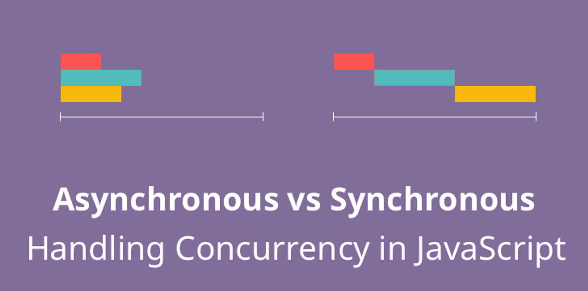
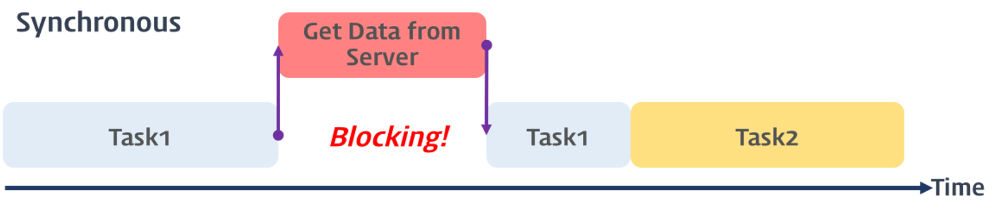
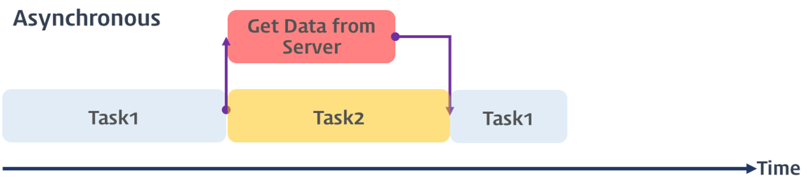
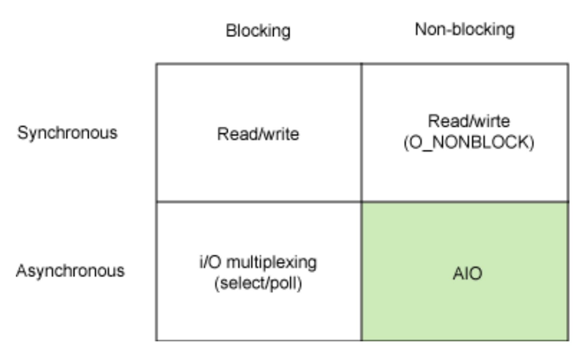

# 동기와 비동기, 새로운 벽

> 아름다운 동기와 비동기의 현 주소입니다.

 

동기와 비동기에 대해 간단하게 들어왔지 이에 대한 깊은 이해를 해본 적은 없었습니다. 오늘은 구현보다 동기와 비동기가 과연 정확히 무엇이고, 어떻게 이를 사용하는지와 더불어 JavaScript에서는 어떻게 동작하는지까지 학습하는 것을 목표로 합니다.

## 동기와 비동기 쉽게 뜯어보기

우선 동기와 비동기가 무엇인지에 대해 알아보는 것으로 학습을 시작해보겠습니다. 우리가 아는 동기의 뜻은 무엇인가요? 동기는 **같은 시기 또는 같은 기간**이라는 의미를 가지고 있습니다. 비동기는 이에 반대되는 개념이 비동기일 것입니다. 프로그래밍에서의 동기와 비동기는 어떤 의미일까요?

 

> **동기 - Synchronous | 동시에 일어나는**
>
> - 동시에 일어난다는 뜻을 가집니다.
> - 어떤 것을 요청하면 이에 대한 결과가 동시에 일어난다는 뜻입니다.
> - 요청을 한다면 얼마나 시간이 걸려도 그 자리에서 결과가 주어져야 합니다.
> - 즉, **순차적**으로 진행된다는 의미입니다. 순서에 맞춰 진행합니다.

 

> **비동기 - Asynchronous | 동시에 일어나지 않는**
>
> - 동시에 일어나지 않음을 의미합니다.
> - 어떤 것에 대한 요청에 의한 결과가 동시에 일어나지 않음을 의미합니다.
> - 요청해도 이를 즉시 처리하지 않아 결과가 이후에 나오게 됩니다.
> - 즉, **여러 개의 요청을 동시에 처리**할 수 있다는 의미입니다.

 

일상에서 쉽게 만나볼 수 있는 동기와 비동기의 예시를 살펴봅시다. 카페에서 공부하기를 좋아하는 컴퓨터공학과 학생 **`😹 고영희`**씨가 카페에 들어가 커피를 주문합니다.

 

> 😹 : 아이스아메리카노 1잔하고, 티라미수 하나 주세요.
> ☕ : 잠시만 여기서 기다려주세요. 바로 준비해드릴게요.

 

어라? 여기서 서서 기다리라구요? 뒤에 사람들 많은데…

 

커피를 **주문**하고 주문한 메뉴를 **받는 것**까지 기다리게 됩니다. 뒤에 줄을 서있는 사람들도 **순차적**으로 기다려가며 커피를 받아가겠죠. 이게 바로 동기의 예시라 할 수 있습니다. 그렇다면 우리가 아는 일반적인 카페는 어떤가요?

 

> 😹 : 아이스아메리카노 1잔하고, 티라미수 하나 주세요.
> ☕ : 준비되면 진동벨로 알려드릴게요.

 

주문을 마친 고영희씨는 자리를 잡고 진동벨이 울릴때까지 기다립니다. 그 자리에서 메뉴를 바로 받지 않고 직원은 바로 다음 사람의 주문을 받겠죠. 이러한 방식으로 **여러 주문을 동시에 받아 처리**하는 것은 비동기의 예시라고 할 수 있습니다. 이렇게 봤을때는 비동기가 좋아보이지 않나요? 그럼 항상 비동기를 사용하면 좋겠네요! 근데 과연 그럴까요? 모든 것에는 장단점이 있기 마련입니다.

 

동기 방식은 매우 직관적입니다. 어떤 작업을 실행하면 끝날때까지, 그리고 순차적으로 진행하기 때문입니다. 하지만, 결과가 주어질 때까지 아무것도 못하고 대기해야 합니다. 반대로 비동기 방식은 결과가 주어지기 전까지 다른 작업을 할 수 있기 때문에 효율적입니다. 하지만 동기 방식에 비해 직관적이지 못하고 복잡하다는 단점이 있습니다.

## 개발에서의 동기와 비동기

자, 그러면 개발에서의 동기와 비동기에 대해 알아봅시다.

 

위 차트는 동기와 비동기의 차이점을 한 눈에 알아볼 수 있습니다. **왼쪽이 비동기, 오른쪽이 동기**에 해당합니다. 동기와 비동기를 각각 한 단어로 간단히 표현하자면, 동기는 ‘직렬적’, 비동기는 ‘병렬적’으로 작동하는 방식이라 할 수 있습니다.

여기서 동기 모델을 살펴보면, `Blocking`을 확인할 수 있습니다. 카페에서 앞 손님이 주문을 마치고 메뉴를 받아가는 시점까지 아무것도 하지 못하는 상황, 다시 말해 동기적인 작업에 따라 이후 작업이 막히게 된 것입니다. 이를 `Blocking`이라 표현합니다. 반대로 작업이 막히지 않으면 `Non-blocking`이라 합니다.

 

그렇다면 동기는 `Blocking`이고, 비동기는 `Non-Blocking`일까요? 이 둘은 비슷할 것 같지만 엄연히 다른 개념입니다.

## Blocking, Non-blocking

동기와 비동기에 대한 각 뜻은 이해했는데, 그렇다면 `blocking`과 `non-blocking`은 도대체 무엇이고, 어떤 차이가 있기에 **엄연히 다른 개념**이라 칭하였을까요? 동기와 비동기는 **직렬과 병렬**처리로 구분하였습니다. `blocking`과 `non-blocking`은 **제어**에서 그 차이가 있습니다.

 

> **Blocking**
>
> - 직접 제어할 수 없는 대상의 작업이 끝날 때까지 제어권을 넘겨주지 않는 것입니다.
> - 사전적인 정의로는 **막혀버린, 제한된, 대기하는** 상태를 의미합니다.
> - 호출된 함수가 자신이 할 일을 모두 마칠 때까지 제어권을 계속 가지고서 호출한 함수에게 바로 돌려주지 않는 경우에 해당합니다.

 

> **Non-Blocking**
>
> - 직접 제어할 수 없는 대상의 작업 처리 여부와 상관이 없습니다.
> - Blocking과는 반대되는 개념입니다.
> - 호출된 함수가 자신이 할 일을 마치지 않았더라도 바로 제어권을 건내주는 경우에 해당합니다.

 

이러한 `Blocking`과 `Non-blocking`은 동기와 비동기에 따라 정해지는 개념이 아닙니다. 동기이면서 `Blocking`일 수도 있으며, `Non-blocking`일 수도 있습니다. 각각이 어떤 경우인지 살펴보겠습니다.

### Sync + Blocking / Async + Non-blocking

이 경우는 우리가 앞에서 살펴본 예시와 동일합니다. 각각을 정리하면 아래와 같습니다.

 

> Sync : 직렬적으로 진행합니다.
>
> Blocking : 제어권을 넘겨주지 않습니다.

 

이에 대한 예시를 들어봅시다.

 

> 😹 : 아이스아메리카노 1잔하고, 티라미수 하나 주세요.
>
> ☕ : 메뉴 나올때까지 여기 서서 기다려주세요.
>
> 😹 : (메뉴 만드는게 궁금해서 지켜봄)
>
> ☕ : A-18번 고객님, 주문하신 메뉴 준비되었습니다.
>
> 😹 : 네! (신나는 마음으로 바로 들고감)

 

그렇다면 반대의 경우는 어떨까요?

 

> Async : 병렬적으로 진행합니다.
>
> Non-blocking : 제어권을 넘겨줍니다.

 

> 😹 : 아이스아메리카노 1잔하고, 티라미수 하나 주세요.
>
> ☕ : 진동벨로 알려드릴게요.
>
> 😹 : (자리 잡아서 노트북 꺼내고 친구랑 카톡 중)
>
> ☕ : (지이이잉— 지이이잉—)
>
> 😹 : (벌떡 일어나서 신나는 마음으로 커피 가지러 감)

 

그렇다면 나머지 경우들은 어떨까요?

### Sync + Non-blocking / Async + Blocking

우선 동기적이면서 Non-blocking인 경우를 살펴보겠습니다.

 

> Sync : 직렬적으로 진행합니다.
>
> Non-blocking : 제어권을 넘겨줍니다.

 

이 경우에는 호출되는 함수는 결과를 처리하는대로 반환하고, 호출하는 함수는 작업 완료 여부를 계속 주시하는 형태로 이루어집니다. 예시를 통해 살펴봅시다.

 

> 😹 : 아이스아메리카노 1잔하고, 티라미수 하나 주세요.
>
> ☕ : 앉아서 기다려주세요.
>
> 😹 : 제꺼 나왔나요?
>
> ☕ : 아니요…
>
> 😹 : 제꺼 나왔나요?
>
> ☕ : 아니요…!!
>
> 😹 : 제꺼 나왔나요?
>
> ☕ : 아니요…!!!!!
>
> ...

 

반대의 경우는 어떨까요?

 

> Async : 병렬적으로 진행합니다.
>
> Blocking : 제어권을 넘겨주지 않습니다.

 

이 경우에는 호출되는 함수의 결과에 관심은 없지만 호출하는 함수는 이 결과를 계속 기다리는 형태입니다. 예시를 통해 살펴봅시다.

 

> 😹 : 아이스아메리카노 1잔하고, 티라미수 하나 주세요.
>
> ☕ : 메뉴 나올때까지 여기 서서 기다려주세요.
>
> 😹 : (메뉴 나왔는지 관심도 없음. 그냥 서서 넷플릭스 시청중)

 

> 이에 대한 내용은 아래 영상을 참고해보시면 더 큰 도움이 될 것 같습니다.
>
> [[10분 테코톡] 🐰 멍토의 Blocking vs Non-Blocking, Sync vs Async](https://www.youtube.com/watch?v=oEIoqGd-Sns)

# 참고

- https://dev-coco.tistory.com/46
- https://velog.io/@maketheworldwise/SyncAsync-BlockingNon-Blocking-%EB%AC%B4%EC%8A%A8-%EC%B0%A8%EC%9D%B4%EC%9D%BC%EA%B9%8C
- https://velog.io/@codemcd/Sync-VS-Async-Blocking-VS-Non-Blocking-sak6d01fhx
- https://musma.github.io/2019/04/17/blocking-and-synchronous.html
- https://ljtaek2.tistory.com/142
- https://velog.io/@gil0127/JS-%EB%B9%84%EB%8F%99%EA%B8%B0-asynchronous
