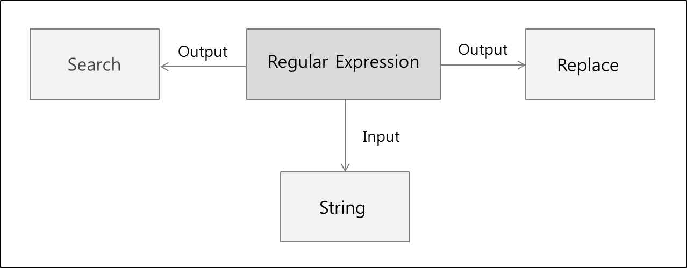

# 블로깅 시작 전에

프로그래머스 문제를 많이 접하면서 `정규 표현식`의 존재를 알게 되었습니다. 이전에 프로젝트 진행 과정에서 이메일 혹은 비밀번호나 아이디 등을 사용자가 입력했을 때, 해당 입력값이 적합한지 판단하게 위해서 `정규 표현식`을 사용하기도 했었습니다.

<br/>

하지만 매번 `정규 표현식`을 사용할 때, 단순히 구글링을 통해서 긁어와 사용해왔습니다. 이렇게 미루어왔던 `정규 표현식`에 대해 알아보고 넘어가고자 포스팅을 진행하게 되었습니다.

<br/>

그리고 이번 포스팅의 주제처럼 **정말 마법같은 정규 표현식의 기능 중 하나**인 `Named Capturing Group`에 대해서도 함께 알아보겠습니다.

# Regular Expression?



<br/>

`Regular Expression`, 다른 말로 `정규 표현식`은 **특정한 규칙을 가진 문자열의 집합을 표현하는 데 사용하는 형식 언어**입니다. 여기서 형식 언어는 다음과 같은 의미를 가지고 있습니다.

<br/>

> [**형식 언어 - formal language**](https://ko.wikipedia.org/wiki/%ED%98%95%EC%8B%9D_%EC%96%B8%EC%96%B4)
>
> - 특정한 법칙들에 따라 적절하게 구성된 문자열들의 집합을 말한다.

<br/>

쉽게 말하자면 **문자열의 특정 형식**을 **표현할 수 있는 방법**이라고 할 수도 있겠습니다. 초반에는 텍스트 편집기에서의 패턴 매칭으로 사용되었기도 하였으며, 수학적인 의미로 시작되었다고 합니다. 지금은 프로그래밍 언어에서 문자열 검색과 치환을 위해서도 사용되고 있습니다.

<br/>

정규 표현식을 사용하면 문자열에 대한 특정 조건을 매우 간단하게 표현할 수 있지만, 특정 표현이 있기 때문에 정규 표현식을 모른다면 이를 이해할 수 없습니다. 이러한 정규 표현식은 `meta 문자`로 구성되어 있습니다.

## meta 문자

> **meta 문자**
>
> - 표현식 내부에서 특정한 의미를 갖는 문자(기호)

<br/>

좀 더 정리하자면, 단순 문자가 아닌 다른 용도로 사용되는 문자를 말합니다. 단일 문자 또는 `\` 가 붙은 단일 문자의 형태로 사용됩니다. 메타 문자는 검사 범위를 지정하거나 수량 혹은 검사 위치를 나타내기도 합니다. 이에 대한 내용을 정리하자면 아래와 같습니다.

### 정규 표현식 정리

|   표현식   | 의미                                                                                              |
| :--------: | ------------------------------------------------------------------------------------------------- |
|    `^x`    | 문자열의 시작을 표현. x 문자로 시작됨을 의미                                                      |
|    `x$`    | 문자열의 종료를 표현. x 문자로 종료됨을 의미                                                      |
|    `.x`    | 임의의 한 문자의 자리수를 표현하며 문자열이 x 로 끝난다는 것을 의미                               |
|    `x+`    | 반복을 표현하며 x 문자가 한 번 이상 반복됨을 의미 (1개 이상)                                      |
|    `x?`    | 존재 여부를 표현하며 x 문자가 존재할 수도 아닐 수도 있음                                          |
|    `x*`    | 반복 여부를 표현하며 x 문자가 0번 또는 그 이상 반복됨을 의미 (0개 이상)                           |
|  `x`\|`y`  | or 를 표현하며 x 또는 y 문자가 존재함을 의미                                                      |
|   `(x)`    | 그룹을 표현하며 x 를 그룹으로 처리함을 의미                                                       |
|  `(x)(y)`  | 그룹들의 집합을 표현하며, 앞부터 순서대로 번호를 부여하여 관리. x, y는 각 그룹의 데이터로 관리됨. |
| `(x)(?:y)` | 그룹들의 집합에 대한 예외를 표현하며 그룹 집합으로 관리되지 않음을 의미                           |
|   `x{n}`   | 반복을 표현하며 x 문자가 n번 반복됨을 의미                                                        |
|  `x{n,}`   | 반복을 표현하며 x 문자가 n번 이상 반복됨을 의미                                                   |
|  `x{n,m}`  | 반복을 표현하며 x 문자가 최소 n번 이상 최대 m 번 이하로 반복됨을 의미                             |
|   `[xy]`   | 문자 선택을 표현하며 x 와 y 중 하나를 의미                                                        |
|   `^xy`    | not 을 표현하며 x 및 y 를 제외한 문자를 의미                                                      |
|  `[x-z]`   | range 를 표현하며 x ~ z 사이의 문자를 의미                                                        |
|    `\^`    | escape 를 표현하며 ^ 를 문자로 사용함을 의미                                                      |
|    `\b`    | word boundary 를 표현하며 문자와 공백 사이의 문자를 의미                                          |
|    `\B`    | non word boundary 를 표현하며 문자와 공백 사이가 아닌 문자를 의미                                 |
|    `\d`    | digit 를 표현하며 숫자를 의미                                                                     |
|    `\D`    | non digit 를 표현하며 숫자가 아닌 것을 의미                                                       |
|    `\s`    | space 를 표현하며 공백 문자를 의미                                                                |
|    `\S`    | non Space 를 표현하며 공백 문자가 아님을 의미                                                     |
|    `\t`    | tab 을 표현하며 탭 문자를 의미                                                                    |
|    `\v`    | vertical tab 을 표현하며 수직 탭 문자를 의미                                                      |
|    `\w`    | word 를 표현하며 알파벳, 숫자, \_ 중의 한 문자임을 의미                                           |
|    `\W`    | non word 를 표현하며 word 가 아닌 문자를 의미                                                     |

> 해당 내용은 [이 블로그](https://hamait.tistory.com/342)를 참고하여 작성하였습니다.

### Flag

정규 표현식을 사용함에 있어 `Flag`를 사용할 수 있습니다. `Flag`는 특정 의미를 가지고 있으며, `Flag`를 사용하지 않는 경우에는 문자열에 대한 검색을 한 번만 처리하고 종료하게 됩니다.

| Flag | 의미                                                            |
| :--: | --------------------------------------------------------------- |
| `g`  | `Global` : 대상 문자열 내의 모든 패턴을 검색                    |
| `i`  | `ignore case` : 대상 문자열에서 대/소문자 식별하지 않음         |
| `m`  | `Multi line` : 대상 문자열이 다중 라인의 문자열인 경우에도 검색 |

# RegExp 사용법

그렇다면, 이러한 정규 표현식을 `JavaScript`에서 어떻게 활용할까요? 관련된 method들을 살펴보겠습니다.

## exec()

`exec`은 **문자열에 대해 특정 부분이 일치하는지를 탐색하여 이에 대한 결과를 알려줍니다**. 결과가 존재하는 경우에는 이에 대한 정보를, 아닌 경우에는 `null`을 반환하여 이를 바탕으로 특정 문자가 존재하는지 판단할 수 있습니다.

<br/>

단순히 일치 여부를 탐색하는 기능에서 더 나아가 `global` flag를 설정하면 `exec`을 활용하여 일치하는 각 부분의 index를 탐색할 수 있습니다. `g flag`를 설정한 regexp로 `exec`를 실행하면, `regexp`에서 `lastIndex`가 변화합니다. 여기서 `lastIndex`는 바로 이전에 일치한 부분의 index에 대한 정보를 가지고 있습니다.

<br/>

예시를 살펴보며 이해해봅시다.

<br/>

```js
// cat 문자열에 대해 global flag를 설정한 정규 표현식
const catRegExp = /cat/g

// test 문자열
const test1 = "i love cat. cat dominates the world."

// 결과 출력
console.log(catRegExp.exec(test1), catRegExp.lastIndex)
console.log(catRegExp.exec(test1), catRegExp.lastIndex)

/*
[
  'cat',
  index: 7,
  input: 'i love cat. cat dominates the world.',
  groups: undefined
] 10
[
  'cat',
  index: 12,
  input: 'i love cat. cat dominates the world.',
  groups: undefined
] 15
*/
```

<br/>

위와 같이 일치하는 문자열의 위치를 `exec`을 이용하여 쉽게 찾을 수 있습니다.

## test()

위에서 언급한 `exec`을 활용해서 정규 표현식을 만족하는지에 대해 판단할 수도 있지만, `test`를 이용하는 것이 목적에 부합하며, 공식 문서에서도 이를 권장하고 있습니다. 주어진 문자열이 해당 정규 표현식을 만족하는지에 대한 여부를 `true/false`로 return 합니다.

<br/>

```js
// cat 정규 표현식
const catRegExp = /cat/

// test 문자열
const test1 = "i love cat. cat dominates the world."

// 결과 출력
console.log(catRegExp.test(test1))

/*
true
*/
```

<br/>

중요한 것은 위의 예시는 **해당 정규 표현식에 대한 문자열이 포함되어 있다면 `true`**라는 것입니다. 특정 문자열 형식과 완전히 동일한지에 대한 여부를 판단하기 위해서는 시작과 끝에 대한 정규 표현식을 작성하도록 합시다.

## match()

`match`는 **주어진 문자열이 정규 표현식과 일치하는 부분을 return** 합니다. 어라? `exec`와의 차이점이 없는 것 같지 않나요? 맞습니다. `g flag`를 설정하지 않는다면 `match`는 `exec`와 동일하게 작동합니다. 그렇다면 `g flag`를 설정한다면 어떻게 작동할까요? 바로 **매칭되는 부분을 배열로 return** 하게 됩니다.

<br/>

```js
// A부터 E까지의 정규 표현식
const alpha = /[A-E]/g

// test 문자열
const test1 = "ABCDEFGHIJKLMNOPQRSTUVWXYZ"

// 결과 출력
console.log(test1.match(alpha))

/*
[ 'A', 'B', 'C', 'D', 'E' ]
*/
```

<br/>

이와 비슷하면서도 다른 `matchAll`도 존재합니다. `matchAll`은 단순히 매칭된 값에 대한 배열만을 return 하는 것이 아닌, **capture group에 대한 정보도 같이 담아 return** 합니다.

<br/>

> **Capture group**
>
> - 정규 표현식에서 `()`로 감싼 그룹

<br/>

어떻게 동작하는지는 예시를 통해 살펴보겠습니다.

<br/>

```js
// cat 정규 표현식
const catRegExp = /(c(a(t)))/g

// test 문자열
const test1 = "i love cat. cat dominates the world."

// 결과 출력
console.log([...test1.matchAll(catRegExp)])

/*
[
  [
    'cat',
    'cat',
    'at',
    't',
    index: 7,
    input: 'i love cat. cat dominates the world.',
    groups: undefined
  ],
  [
    'cat',
    'cat',
    'at',
    't',
    index: 12,
    input: 'i love cat. cat dominates the world.',
    groups: undefined
  ]
]
*/
```

## Named Capturing Group

**이번 정규 표현식 포스팅의 핵심**입니다. 정규 표현식 기능 중 하나로, 정규 표현식 패턴에 매칭된 그룹에 특정한 이름을 주는 것입니다. 이 기능은 아래와 같은 문법으로 사용이 가능합니다.

<br/>

```
(?<name>pattern)
```

<br/>

해당 기능을 사용하면 `match`로 return 받는 array 내부의 `group` 속성에 `name : value` 쌍의 프로퍼티로 이루어진 객체로 매칭된 데이터를 받아올 수 있게 됩니다. **정규 표현식으로 단순히 문자열 내의 특정 값을 캐치하는 것에서 끝나는 것이 아닌, 파싱까지 가능하다?**... 정말 마법같은 기능입니다!🪄 이를 바탕으로 예시를 작성하자면 아래와 같습니다.

<br/>

```js
// 이름, 성, 전화번호가 공백으로 구분된 문자열을
// 파싱하기 위한 정규 표현식
const personalInfo =
  /(?<firstName>[\w]+)\s+(?<lastName>[\w]+)\s+(?<number>[\d]+)/

// test 문자열
const test1 = "Harry Potter 01012345678"

// match 결과 출력
console.log(test1.match(personalInfo))

/*
[
  'Harry Potter 01012345678',
  'Harry',
  'Potter',
  '01012345678',
  index: 0,
  input: 'Harry Potter 01012345678',
  groups: [Object: null prototype] {
    firstName: 'Harry',
    lastName: 'Potter',
    number: '01012345678'
  }
]
*/

// 전화번호 출력
console.log(test1.match(personalInfo).groups.number)

/*
01012345678
*/
```

<br/>

정말 너무나도 간편하게 **문자열에서 원하는 부분만 파싱하여 바로 객체 형태로 return** 받을 수 있습니다. 특정 seperator를 기준으로 직접 `split`을 진행하여 저장했던 이전 방식과 비교할 수 없을 만큼 간단합니다.

## search()

`search`는 **주어진 문자열에서 정규 표현식과 일치하는 가장 첫 번째 부분의 index를 return** 합니다. 찾지 못할 경우에는 `-1`을 return 합니다.

<br/>

```js
// cat 정규표현식
const catRegExp = /cat/

// test 문자열
const test1 = "i love cat. cat dominates the world."

// 결과 출력
console.log(test1.search(catRegExp))

/*
7
*/
```

## replace()

`replace`에서도 정규 표현식을 사용할 수 있다는 사실, 알고 계셨나요? `replace`는 **정규 표현식에 해당하는 문자열을 변경**해줍니다. 예시를 살펴봅시다.

<br/>

```js
// cat 정규표현식
const catRegExp = /cat/

// test 문자열
const test1 = "i love cat. cat dominates the world."

// 결과 출력
console.log(test1.replace(catRegExp, "dog"))

/*
i love dog. cat dominates the world.
*/
```

<br/>

이와 비슷한 `replaceAll`이라는 method도 존재합니다. `replaceAll`은 정규 표현식에 해당하는 모든 부분을 해당 문자열로 교체해줍니다. 단, `g flag`를 꼭 설정해야 합니다.

<br/>

```js
// cat 정규표현식
const catRegExp = /cat/g

// test 문자열
const test1 = "i love cat. cat dominates the world."

// 결과 출력
console.log(test1.replaceAll(catRegExp, "dog"))

/*
i love dog. dog dominates the world.
*/
```

<br/>

사실 **`replace`에서 인자로 넘겨주는 정규 표현식에 `g flag`를 설정해주는 것으로 `replaceAll`과 동일한 동작**을 하도록 할 수 있습니다. 차이점이라면 `replaceAll`은 `g flag`가 설정되지 않는다면 오류가 발생한다는 점입니다. 명시적으로 **모두 변경함**을 나타내고 싶다면 `replaceAll`을 사용하면 되겠습니다.

# 참고

- [MDN web docs 정규 표현식 번역본](https://developer.mozilla.org/ko/docs/Web/JavaScript/Guide/Regular_expressions)
- [RegExp.prototype.exec()](https://developer.mozilla.org/ko/docs/Web/JavaScript/Reference/Global_Objects/RegExp/exec)
- [RegExp.prototype.test()](https://developer.mozilla.org/ko/docs/Web/JavaScript/Reference/Global_Objects/RegExp/test)
- [String.prototype.match()](https://developer.mozilla.org/ko/docs/Web/JavaScript/Reference/Global_Objects/String/match)
- [String.prototype.matchAll()](https://developer.mozilla.org/en-US/docs/Web/JavaScript/Reference/Global_Objects/String/matchAll)
- [Named capturing group: (?<name\>...)](https://developer.mozilla.org/en-US/docs/Web/JavaScript/Reference/Regular_expressions/Named_capturing_group)
- [String.prototype.search()](https://developer.mozilla.org/ko/docs/Web/JavaScript/Reference/Global_Objects/String/search)
- [String.prototype.replace()](https://developer.mozilla.org/ko/docs/Web/JavaScript/Reference/Global_Objects/String/replace)
- [String.prototype.replaceAll()](https://developer.mozilla.org/ko/docs/Web/JavaScript/Reference/Global_Objects/String/replaceAll)
