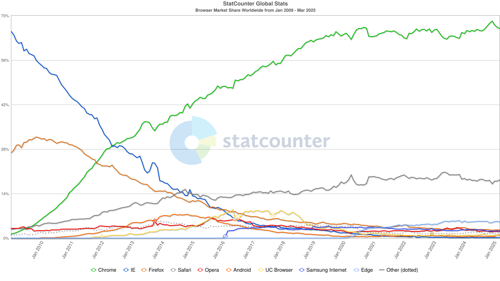
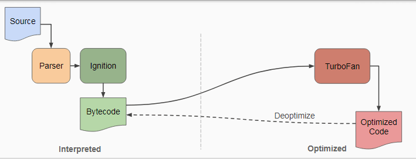
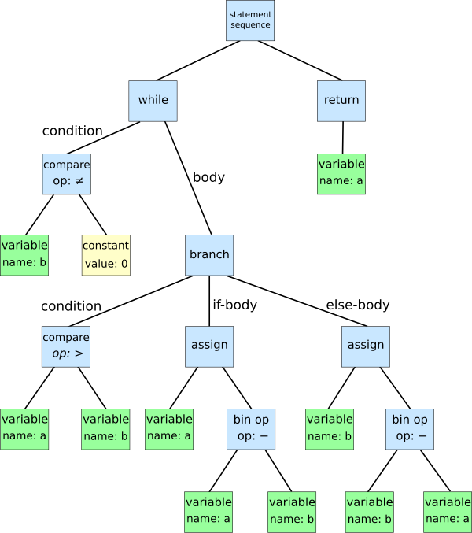
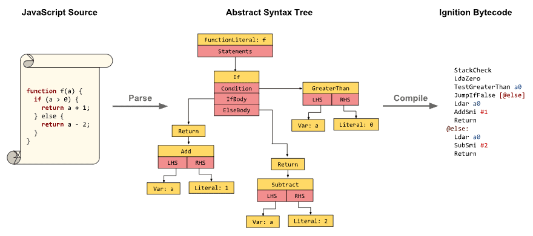

<br/>

> 본 포스팅은 JavaScript는 알지만 V8 엔진이 무엇인지 모르는 독자를 대상으로 합니다.

<br/>

# Google의 V8 엔진

JavaScript를 공부하다 보면 V8 엔진이라는 단어를 한 번쯤 접하게 됩니다. JavaScript는 프로그래밍 언어이기 때문에 코드를 해석하고 실행시켜줄 수 있는 무언가가 필요합니다. 이 무언가가 바로 ‘JavaScript 엔진’입니다.

<br/>

> **JavaScript 엔진([Wikipedia](https://ko.wikipedia.org/wiki/%EC%9E%90%EB%B0%94%EC%8A%A4%ED%81%AC%EB%A6%BD%ED%8A%B8_%EC%97%94%EC%A7%84))**
>
> 자바스크립트 엔진(JavaScript engine)은 자바스크립트 코드를 실행하는 프로그램 또는 인터프리터이다. … 여러 목적으로 자바스크립트 엔진을 사용하지만, 대체적으로 웹 브라우저에서 사용된다.

<br/>

앞서 언급한 ‘V8 엔진’ 역시 JavaScript 엔진의 일종입니다. Google하면 떠오르는 Chrome 브라우저와 더불어 Node.js에서 V8 엔진을 사용합니다.

<br/>

> **What is V8?([v8.dev](https://v8.dev/))**
>
> V8 is Google’s open source high-performance JavaScript and WebAssembly engine, written in C++. It is used in Chrome and in Node.js, among others.
>
> ---
>
> V8은 C++로 작성된 Google의 오픈소스 고성능 JavaScript, WebAssembly 엔진이다. 이는 Chrome과 Node.js 등에서 사용된다.

<br/>

## V8 엔진이 중요한 이유

JavaScript는 과거 웹페이지를 동적으로 만들기 위한 목적으로 탄생했습니다. 다만 브라우저 중심으로 사용되었기 때문에 이전에는 브라우저 바깥으로 확장되기 어려웠습니다. 그러나 2008년 Google에서 오픈 소스로 개발한 V8 엔진을 기점으로 Node.js가 등장하면서 다양한 곳에 JavaScript가 활용되기 시작했습니다.

<br/>

JavaScript 엔진이 하나만 존재하는 것도 아닐텐데, **왜 V8 엔진을 가장 많이 언급할까**요? Safari 브라우저의 JavaScriptCore(Nitro)나 Firefox 브라우저의 SpiderMonkey도 있는데 말이죠. 이에 대해서는 아래의 내용들이 그 이유가 될 수 있다고 생각합니다.

<br/>



<br/>

우선 현존하는 브라우저 중에서 Chrome 브라우저의 점유율이 압도적으로 높다는 점입니다. (2025년 3월 10일 기준으로) **무려 66.29%에 달하는 높은 점유율**을 보여줍니다. 더불어 Chromium 기반 브라우저가 많다는 점도 있습니다. 여기서 Chromium은 Chrome의 기반이 되는 오픈소스 프로젝트로, Chrome의 어머니 격이 되는 브라우저입니다.

<br/>

Chrome부터 시작해 Windows 기본 브라우저인 Edge, Opera나 네이버 Whale, 갤럭시 스마트폰 기본 브라우저인 삼성 인터넷까지 모두 Chromium을 기반으로 제작되었습니다. 물론 이 브라우저들은 전부 V8 엔진을 기반으로 합니다.

<br/>

**빠른 속도**도 이유가 될 수 있습니다. 2008년, V8 엔진을 기반으로 하는 Chrome 브라우저가 출시된 당시에는 IE 브라우저가 가장 높은 점유율을 가지고 있었습니다. (Statcounter 기준 2009년 1월 당시 64.97%) 대세였던 IE 브라우저와 비교했을 때, 사용자가 육안으로 확인이 가능한 수준으로 Chrome 브라우저는 정말 빠른 속도를 보여주었다고 합니다.

<br/>

더불어 JavaScript가 **브라우저 바깥으로 나올 수 있도록 된 계기**이기도 합니다. V8 엔진의 등장으로 자서버에서 사용될 수 있도록 Node.js가 탄생했고, 이를 기점으로 모바일, 데스크톱 애플리케이션 등 다양한 환경에서 활용될 수 있게 되었습니다.

<br/>

정리하자면, **V8 엔진은 JavaScript 코드를 실행하기 위한 ‘JavaScript 엔진’의 일종**이며, 당시에 **차별화된 속도**를 보여주었다는 것입니다.

<br/>

# V8 엔진의 구조

그렇다면 V8 엔진은 어떤 차별점이 있었기에 당시 다른 엔진과 차이가 있었을까요? 이에 대한 내용 이전에 V8 엔진이 어떻게 구성되어 있는지에 대해 간단히 알아보고자 합니다. (각 부분에 대한 내용은 추후 다른 포스팅에서 알아볼 예정입니다.)

<br/>

## V8 엔진이 코드를 실행하는 과정



<br/>

V8 엔진은 JavaScript 코드를 여러 단계에 걸쳐 변환하게 됩니다. JavaScript로 작성한 소스 코드를 먼저 **파서**(parser)에게 넘깁니다. 파서는 주어진 소스 코드를 **의미있는 단위로 분해하고, 파스 트리(parse tree)를 만들**게 되는데, 이를 **파싱**(parsing)이라 합니다. 파싱은 쉽게 말해 문장 해석이라 볼 수 있습니다. 문장을 이루고 있는 단어들을 분해하고, 이 사이의 관계를 분석하는 것이죠. 또한 여기서 ‘의미있는 최소 단위’를 **토큰**(token)이라고 합니다. 즉, 파서에 의해 토큰화(Tokenization)와 파싱(parsing) 과정을 거치게 됩니다.

<br/>

변환된 파스 트리는 다시 **AST(Abstract Syntax Tree), 추상 구문 트리로 변환**됩니다. 소스 코드의 구조를 트리 형태로 나타낸 것입니다. 간단한 예시를 살펴봅시다. 두 자연수의 최대공약수를 구하는 ‘유클리드 호제법’을 단순한 형태의 AST로 바꿔봅시다.

<br/>

```python
while b ≠ 0
	if a > b
		a := a − b
	else
		b := b − a
return a
```

<br/>



<br/>

트리를 타고 내려가며 프로그램의 구조와 흐름을 쉽게 알 수 있습니다. 그렇다면 JavaScript 코드는 어떠한 형태로 변환될까요? 두 변수를 더해 반환하는 함수 코드를 예시로 살펴봅시다.

<br/>

```jsx
function add(x, y) {
  return x + y;
}

// 이 코드는 대략 아래와 같이 변형된다. (생략된 부분 존재)

{
  "type": "FunctionDeclaration",
  "name": "add",
  "params": [
    { "type": "Identifier", "name": "x" },
    { "type": "Identifier", "name": "y" }
  ],
  "body": {
    "type": "BlockStatement",
    "body": [
      {
        "type": "ReturnStatement",
        "argument": {
          "type": "BinaryExpression",
          "operator": "+",
          "left": { "type": "Identifier", "name": "x" },
          "right": { "type": "Identifier", "name": "y" }
        }
      }
    ]
  }
}
```

<br/>

변환된 AST는 인터프리터에 해당하는 Ignition에게 전달됩니다. **Ignition은 AST를 실행할 수 있는 바이트 코드로 변환**하게 됩니다.

<br/>



<br/>

> **바이트 코드([Wikipedia](https://ko.wikipedia.org/wiki/%EB%B0%94%EC%9D%B4%ED%8A%B8%EC%BD%94%EB%93%9C))**
>
> 바이트코드(bytecoe, portable code, p-code)는 특정 하드웨어가 아닌 가상 컴퓨터에서 돌아가는 실행 프로그램을 위한 이진 표현법이다.
>
> ---
>
> 쉽게 이해하자면 고수준 언어를 가상머신이 이해할 수 있도록 변환한 저수준이 아닌 중간 수준의 언어입니다.

<br/>

그렇다면, 아직까지 설명하지 않은 **TurboFan**은 무슨 역할을 하는 것일까요? 이는 V8 엔진의 가장 큰 차별점인 **JIT 컴파일**이라는 개념과 관련이 있습니다.

<br/>

## JIT 컴파일

**자바스크립트는 인터프리터(interpreter) 언어**입니다. 풀어서 이야기하자면 코드를 한 줄씩 읽고 바로 실행하는 방식입니다. 코드를 실행하기 전에 **기계어로 모두 변환해야 하는 컴파일러(compiler) 언어**와 달리 바로 실행이 가능합니다. 그렇기에 빠르게 시작하지만 매번 한 줄씩 실행해야 하기 때문에 실행 속도는 느립니다.

<br/>

> **JIT 컴파일([Wikipidia](https://ko.wikipedia.org/wiki/JIT_%EC%BB%B4%ED%8C%8C%EC%9D%BC))**
>
> JIT 컴파일(just-in-time compilation) 또는 동적 번역(dynamic translation)은 프로그램을 실제 실행하는 시점에서 기계어로 번역하는 컴파일 기법이다.

<br/>

이 2가지의 장점을 결합한 방식이 바로 **JIT 컴파일**입니다. V8 엔진에서 Ignition은 바이트 코드로의 변환을 담당하고, 그 중에서 자주 사용되는 코드는 TurboFan이 처리하게 됩니다. **TurboFan은 전달받은 코드를 최적화된 기계어로 변환**해줍니다.

<br/>

# 마치며

V8 엔진의 작동 방식을 단순하게 정리해보자면 다음과 같습니다.

- 소스 코드는 파서에 의해 AST로 변환.
- AST는 Ignition에 의해 바이트 코드로 변환.
- 자주 사용되는 코드는 TurboFan이 최적화된 기계어로 변환.

<br/>

다만, 본 포스팅에서 다룬 내용은 V8 엔진의 가장 표면적인 개념에 불과합니다. Ignition이 어떻게 자주 사용되는 코드(Hot Path)를 감지하는지와 더불어 파싱과 AST 생성 과정, Crankshaft와 Full-codegen 등 좀 더 자세한 내용들이 많습니다.

<br/>

더불어 Hidden Class, Inline Caching, Deoptimization 등 최적화를 위한 주요 개념들도 있습니다. 이와 관련해서는 추후 다른 포스팅으로 다루겠습니다.

<br/>
